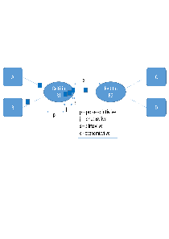
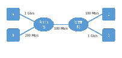

<text-box variant='learningObjectives' name='Oppimistavoitteet'>

- Osaat kuvata mistä sanomien viivästymiset johtuvat
- osaat laskea erilaisia viivästymisiä
- osaat arvioida verkon toimintakykyä ja havaita pullonkauloja

</text-box>

## Viipeet

Paketit etenevät sähkövirtana, valona tai sähkömagneettisena säteilynä aina vakionopeudella yhdellä yhteysvälillä eli linkillä. Lähettäjän ja vastaanottajan pitää tällöin toimia paketin siirrossa tällä samalla nopeudella. Eri yhteysväleillä on käytössä erilaisia siirtonopeuksia, jotka kuten olemme jo oppineet ilmaistaan bitteinä sekunnissa (bits per second, bps). Vaikka säteily, valo ja sähkövirta siirtyvät vakionopeudella, niin eri yhteysvälien siirtonopeudet voivat poiketa toisistaan. Tämä johtuu ennen kaikkea siitä, miten bitit koodataan tälle fyysiselle siirtotielle. Yksittäisen bittivirran lähettämiseen voidaan käyttää kantataajuuskaistaan (baseband) perustuvaa lähetystä. Tällöin osa kaistasta kuvaa 0:aa ja osa 1:stä. Jos tarvitaan monimutkaisempaa bittien koodausta, niin sitä kutsutaan [modulaatioksi](https://fi.wikipedia.org/wiki/Modulaatio_(elektroniikka)). Siinä siis muokataan eli moduloidaan 'kantoaaltoa', eli valoa, sähköä tai säteilyä, siten että se voi siirtää mukanaan dataa. Tällä kurssilla emme opettele näitä modulointitekniikoihin sen tarkemmin, mutta niihin viitataan aina silloin, kun se on kurssin sisällön kannalta tarpeellista.

Sanoman kulkuun verkossa vaikuttavat erityisesti erilaiset viipeet.  Edellisellä kurssilla, Tietoliikenteen perusteet 1, opimme jo kokonaisviipeeseen vaikuttavien neljän viipeen nimet, jotka olivat siirtoviive, prosessointiviive, etenemisviive ja jonotusviive.
Nämä viiveet lasketaan aina yhden pakettikytkentäisen verkon solmun näkökulmasta. Paketin koko kulkuaika lähettäjältä vastaanottajalle on kaikkien paketin kulkuun vaikuttavien solmujen kokonaisviiveiden summa.

Kuva 1: Kuvassa on neljä laitetta A, B, C ja D, jotka kommunikoivat keskenään reitittimien 1 ja 2 avulla. Verkossa on liikkeellä paljon paketteja eri yhteysväleillä. Tähän peruskuvaan on piirretty näkyville myös eri viipeet ja missä vaiheessa ne reitittimen 1 osalta tapahtuvat. Saman viiveet toki ovat myös kaikilla laitteilla ja reitittimellä 2, vaikka niitä ei ole kuvaan merkitty.

### Siirtoviive

Siirtoviive (engl. transmission delay) on näistä kaikkein tutuin. Sen laskukaava on  sv = L/R, missä L on paketin (tai siirrettävän datan) koko bitteinä ja R on linkin nopeus bitteinä sekunnissa (bps). Näin saadaan siirtoviive, eli siirron kesto, sekunteina.

Vastaavia laskuja tehtiin edellisellä kurssilla arvioina koko tiedoston siirron kestosta. Tällöin oikeastaan lasketaan vain se, kuinka kauan lähettäjältä kestää laittaa kyseinen tiedosto matkaan eli siirtää se linkkiin. Koska verkossa on useita toimijoita, jotka kaikki siirtävät tietoa seuraavalle, niin yhden solmun siirtoviiveen tarkastelulla saadaan vain karkea alaraja-arvio siirron kokonaiskestosta.

<quiz id="9ad14940-7b49-4277-949c-cca763aa28ba"></quiz>

### Prosessointiviive

Prosessointiviive (engl. processing delay) muodostuu solmun omasta viestin käsittelystä. Tämä jakautuu viestin vastaanottoon, viestin prosessointiin ja valmisteluun lähetystä varten. Tyypillisesti verkon sisällä toimivat solmut ovat reitittimiä, jolloin ne vastaanottavat paketin fyysisen kerroksen välityksellä. Sieltä paketti päätyy linkkikerrokselle käsittelyyn ja linkkikerrokselta edelleen verkkokerrokselle.
Vastaanottovaiheessa paketista poistetaan linkkikerroksen otsake. Samalla täytyy tarkistaa paketin eheys. Tällöin voidaan havaita mahdolliset syntyneet bittivirheet, kun paketista laskettua tarkistussummaa verrataan linkkikerroksen otsakkeessa olevaan tarkistussummaan. (Tarkistussumman laskennasta lisää myöhemmin kurssilla.) Jos paketti on vioittunut, niin se hylätään eikä sitä välitetä edelleen verkkokerrokselle.
Reitittimissä viestin varsinainen prosessointi eli reitityspäätös tehdään verkkokerroksella. Tällöin paketin vastaanottajan IP-numeron perusteella reititin katsoo reititystaulustaan mihin ulosmenevään linkkiin paketti pitää lähettää, jotta se aikanaan päätyisi vastaanottajalle. Reitittimen pitää siis siirtää paketti vastaanottolinkistä lähetyslinkkiin. Tämän kuluu aikaa, joka on osa prosessointiviivettä.
Kun paketti on valmis lähetettäväksi eteenpäin, se toimitetaan verkkokerrokselta linkkikerrokselle. Linkkikerros lisää tähän verkkokerroksen pakettiin oman otsakkeensa. Otsakkeen lisäyksen yhteydessä lasketaan mm. paketin linkkikerroksen tarkistussumma ja tarvittaessa selvitetään vastaanottajan MAC-osoite silloin kun linkkinä toimii Ethernet-verkko.

Wikipedian sivulla https://fi.wikipedia.org/wiki/Prosessointiviive on kuvattu muutakin toimintaa, josta aiheutuu prosessointiviivettä.

### Etenemisviive

Etenemisviive (engl. propagation delay) on se aika, joka yhdeltä bitiltä kestää kulkea fyysisellä siirtotiellä lähettäjältä vastaanottajalle. Tähän vaikuttaa erityisesti käytettävä siirtomedia ja lähettäjän ja vastaanottajan fyysinen etäisyys. Tämä voidaan ilmaista kaavana ev = D/S, jossa D on etäisyys ja S on bitin etenemisnopeus siirtotiellä. Tällä kurssilla käytämme etenemisnopeuden arviona aina valonnopeutta, vaikka tavallisesti etenemisnopeus on hiukan sitä pienempi.

Valonnopeuden tarkempi selitys löytyy [wikipediasta](https://fi.wikipedia.org/wiki/Valonnopeus). Tämän kurssin tarpeisiin [Ursan hyvin tiivis kuvaus](https://www.ursa.fi/extra/kosmos/v/valon_nopeus.html) on riittävä.

<quiz id="a2261435-811f-4b31-b7a5-d6585422e987"></quiz>

### Jonotusviive

Jonotusviive (engl queuing delay) on näistä viipeistä hankalin, koska se vaihtelee ruuhkan mukana. Jos solmussa ei ole yhtään pakettia jonossa, niin jonotusviivettäkään ei muodostu, kun paketti voidaan välittömästi toimittaa seuraavaan linkkiin.
Toisaalta jonotusviive voi olla hyvinkin pitkä, jos kyseinen solmu on hyvin ruuhkainen ja paketteja on paljon jonossa. Jonoihin ja jonotukseen liittyy vahvasti matematiikan haara jonoteoria, joka nimenomaan tutkii näitä ilmiöitä. Koska jokaisen paketin kokemus jonosta on erilainen, niin jonojen tarkastelussa käytetään nimenomaan tilastollisia suureita kuten keskiarvo, varianssi ja todennäköisyys.
Yksinkertainen kaava, jolla jonotuksen kestoa voi arvioida on liikenteen intensiteetti (engl. traffic intensity), on La/R, missä L on paketin koko (yksinkertaisesti oletetaan paketit samankokoisiksi), a on keskimääräinen pakettien jonoon saapumisnopeus (paketteja sekunnissa) ja jakaja R on linkin siirtonopeus (bittejä sekunnissa). (TODO vaihtoehtoisesti: Jonotuksen kestoa voi arvioida liikenteen intensiteettiä (engl. traffic intensity) kuvaavalla yksinkertaisella kaavalla La/R, missä L on paketin koko (yksinkertaisesti oletetaan paketit samankokoisiksi), a on keskimääräinen pakettien jonoon saapumisnopeus (paketteja sekunnissa) ja jakaja R on linkin siirtonopeus (bittejä sekunnissa). ) Tästä kaavasta on helppo havaita, että jos paketteja saapuu jonoon enemmän kuin linkki voi lähettää (La/R >1), niin jono kasvaa. Jos puskurin kokoa ei rajoiteta, niin jono voi kasvaa äärettömästi ja näin ollen myös paketin jonotusviive voi kasvaa äärettömästi. Jos taas puskurin koko rajoittaa jonon kasvua, niin paketteja joudutaan pudottamaan ja ne katoavat pääsemättä koskaan perille.
Jonoja voi silti muodostua vaikka liikenteen intensiteetti olisikin pienempi tai yhtä suuri kuin 1 (eli La/R<1). Näin voi käydä jos hetkellisesti pakettien määrä ylittää linkin kapasiteetin esimerkiksi paketteja tulee useammasta linkistä yhtenä ryöppynä. Toisaalta vaikka intensiteetti olisikin lähellä ykköstä, niin jos paketit saapuvat tasaisin väliajoin, niin ne eivät joudu jonottamaan, koska edellinen paketti on juuri saatu lähetettyä ennen seuraavan saapumista.
Todellisuudessa yhden reitittimen osalta emme pysty ennustamaan pakettien saapumisia (jaksollisuutta tai saapumisväliä), joten pakettien oletetaan saapuvan satunnaisesti (random). Tällöin paketteja saapuu välillä enemmän ja välillä vähemmän, mutta niiden jakaumaa ei tiedetä ennalta.

Lisätietoa kiinnostuneille: Jonot ja jonotus on niin tavallista, että sille on ihan oma jonoteoria. Wikipedian englanninkielinen sivu [Queueing theory](https://en.wikipedia.org/wiki/Queueing_theory) antaa perustiedot asiasta kiinnostuneelle. Tällä kurssilla jonotusta ja sen vaikutuksia ei käsitellä tämän enempää.

<quiz id="a56e2695-83bc-4ac6-8623-daaed29eca23"></quiz>

## Läpäisy tai läpimeno

Englanninkielistä termiä throughput ei valitettavasti vastaa yksi tietty suomenkielinen termi, vaan sille on jouduttu erilaisiin tilanteisiin ja tieteenaloille kehittämään useita erilaisia käännöksiä.  Läpäisy ja läpimeno ovat synonyymeja, jotka tarkoittavat suurin piirtein samaa eli miten paljon jotakin valmistuu tietyssä ajassa tai miten kauan johonkin tiettyyn asiaan tai prosessin menee aikaa.

Viipeiden kanssa tarkastelimme asiaa yhden verkon solmun kohdalta. Läpimenoakin voisi tarkastella vain kahden solmun välillä. Silloin se määrittyy suoraan kyseisen linkin nopeudesta, koska se kertoo meille suoraan, kuinka monta bittiä kyseisestä linkistä pääsee läpi sekunnissa.

Nyt tarkastelemme paketin (tai oikeammin bittien) kulkua kokonaisuudessaan lähettäjältä vastaanottajalle. Pakettihan kulkee matkalla usean eri linkin kautta, joilla on erilaiset nopeudet. Koko reitin läpäisyä rajoittaa hitain linkki. Näin ollen päästä-päähän -yhteyden läpäisy on yhtä suuri kuin hitaimman linkin nopeus. Tässä täytyy huomioida myös linkin jakaminen. Jos tietty lähettäjän ja vastaanottajan välinen liikenne saa vain osan linkistä käyttöönsä, niin silloin tällä yhteydellä tuon linkin nopeus on vain tämä osa koko nopeudesta. Näin jokin näennäisesti nopeampi linkki voikin olla liikennöintinopeutta rajoittava.  Tätä rajoittavaa linkkiä kutsutaan usein "pullonkaulaksi". Jos lähettäjän ja vastaanottajan välistä liikennettä halutaan nopeuttaa, niin nopeutus on kohdistettava nimenomaan pullonkaulaan. Muiden yhteysvälien nopeuttaminen ei auta.  Mieti hetki miksi näin on.

KUVA 2: Kuvaan on merkitty eri linkkien maksiminopeudet. Näistä on helppo havaita, että reitittimien välinen linkki (100 Mb/s) on hitain. Näin voidaan olettaa, että se muodostaa tässä verkossa pullonkaulan.

<quiz id="a13067de-805c-4101-95fe-d513928b2598"></quiz>

Paketin koko vaikuttaa viestin kulkuaikaan lähettäjältä vastaanottajalle. Internet on ns. etappivälitteinen (engl. store-and-forward). Perusmallissa paketti vastaanotetaan kokonaisuudessaan ennen kuin sitä käsitellään solmussa sen tarkemmin ja vasta sen jälkeen paketti lähetetään eteenpäin. Uudet reitittimet osaavat käsitellä paketteja jo silloin, kun ne vielä vastaanottavat paketin loppuosaa. Tällainen nopeampi edelleenlähetys (engl. fastforward) nopeuttaa erityisesti isojen pakettien kulkua, kun siirtoviiveen vaikutus pienenee. Vaikutus on samankaltainen kuin paketin pilkkominen pienemmiksi paketeiksi.

Oletetaan ensin, että yllä olevassa kuvassa B lähettää  1 megatavun kokoisen tiedoston C:lle yhtenä pakettina. Tällöin paketti siirretään ensin kokonaisuudessaan B:ltä Reitittimelle 1. Tähän siirtoon kuluu (1 megatavu * 8 bittiä / tavu) / (200 kb/s) = 8 000 000 / 200 000 sekuntia =  40 sekuntia. Sitten Reititin 1 siirtää tämän paketin reitittimelle R2, mihin kuluu 80 sekuntia. Lopuksi Reititin 2 siirtää paketin C:lle. Tähänkin kuluu 80 sekuntia. Kokonaisuudessaan siirtoon kuuluu siis 40 sekuntia + 80 sekuntia + 80 sekuntia = 200 sekuntia eli yli 3 minuuttia.

Oletetaan sitten, että tämä 1 megatavun kokoinen tiedosto pilkotaan 1 kilotavun paketeiksi. Nyt yhden paketin siirtoon kuluu aikaa enää (8 kb / 200 kb/s)+ (8 kb/100 kb/s) + (8kb / 100 kb/s) = 0,2 sekuntia. Näitä paketteja on kaikkiaan 1 megatavu / 1 kilotavu = 1000 kappaletta. Paketit kulkevat kuitenkin lomittain siten, että vain viimeisen (tai ensimmäisen) yhteysvälin osalta pitää ottaa huomioon kaikki paketit. Koko tiedoston siirtoon reitittimeltä C:lle kuluu tuo sama 80 sekuntia (eli 1000 * 8 kb / 100 kb/s) kuin edellisessäkin laskelmassa. Jos nyt laskemme yhteen kaikkien pakettien siirron yhden linkin yli ja yhden paketin kulkuajan lähettäjältä vastaanottajalle tulemme laskeneeksi yhden paketin siirron yhden linkin yli mukaan laskelmaan kahteen kertaan.  Piirrä itsellesi kuva, jonka perusteella voit vakuuttua tästä!  Kokonaissiirtoaika tässä on siis 80 + 0,12 eli 80,12 sekuntia.

<quiz id="afbefe02-8bf3-4a73-b71d-e851c2c6b59b"></quiz>  - tehtäväksi laskea siirron kesto kolmen linkin yli yhtenä pakettina ja pilkottuna useampaan pieneen pakettiin!

## Muita käsitteitä näihin liittyen

Vaikka edellä keskityimme vain yhteen pakettiin liittyviin viipeisiin, niin tietoliikenteessä yleisesti kiinnostaa liikennöintinopeus, läpäisy ja erilaiset viipeet yli kaikkien tietyllä ajanjaksolla kulkeneiden pakettien. Niistä voimme esimerkiksi laskea vaikkapa keskimääräisen läpäisyn. Toki voimme tarkastella näiden mmitattujen pakettien havaitsemien viipeiden ja siirron kokonaiskeston vaihtelua. Tyypillisiä pakettien siirtoaikojen vaihtelua aiheuttavia seikkoja ovat erilaisten jonotusajat matkan varrella. Siirtoviive, prosessointiviive ja etenemisviive on edellä oletettu vakiollisiksi.  Tällaisesta vaihtelusta voidaan käyttää englanninkielistä termiä [jitter](https://fi.wikipedia.org/wiki/Jitter), jonka voisi ehkä tässä yhteydessä suomentaa hajonnaksi tai huojunnaksi. Itse suosittelen käyttämään termiä pakettiviipeiden hajonta (engl. [packet delay variation](https://en.wikipedia.org/wiki/Packet_delay_variation) tai viipeiden hajonta, joka on paljon kuvaavampi termi tästä ilmiöstä.

