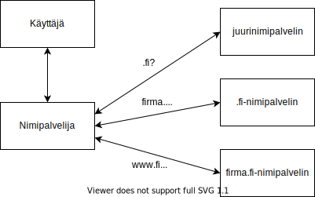

<text-box variant='learningObjectives' name='Oppimistavoitteet'>

- Osaat kuvata, mihin nimipalvelua käytetään ja mitä tietoja sen tietueissa on
- Osaat kertoa, mihin DNS-protokollaa käytetään
- Osaat sanallisesti kertoa, miten nimeä vastaava IP-osoite löydetään

</text-box>

## Nimipalvelu DNS

Nimipalvelu (engl. Domain Name Service, DNS) tarjoaa internetin muille sovelluksille mahdollisuuden selvittää tiettyä verkkonimeä vastaava IP-numero tai päinvastoin. Sitä kutsutaankin usein internetin puhelinluetteloksi. Aiemmalla kurssilla käytimme jo nimipalvelua tässä tehtävässä. Nyt tarkastelemme, miten palvelu toimii.

Meillä on käytössä useita erilaisia nimipalvelijoita. Paikallinen nimipalvelija (engl. local name server) vastaanottaa käyttäjän koneelta nimipalvelupyynnön ja ratkaisee sen. Viralliset nimipalvelijat, ns. autoritääriset nimipalvelijat, puolestaan hallinnoivat nimipalvelutietoja.

### Paikallinen nimipalvelija

Paikallisia nimipalvelijoita saatetaan niiden ratkaisijaroolin vuoksi kutsua myös englanninkielestä johdetulla nimellä "resolveri". Paikallisen nimipalvelijan tehtävä on ratkoa sen omilta asiakkailtaan saamia nimipalvelupyyntöjä. Tämän se tekee joko vastaamalla suoraan omien tietojensa perusteella tai lähettämällä pyyntöjä virallisen nimipalveluhierarkian nimipalvelijoille. Katsotaan toimintaa tarkemmin, kun on ensin tutustuttu virallisiin nimipalvelijoihin ja nimipalvelutietueisiin.

Koska paikallien nimipalvelija ei vastaa mistään nimialueesta suoraan, niin se ei kuulu viralliseen nimipalvelijahierarkiaan. Sen sijaan paikallinen nimipalvelija säilyttää omassa muistissaan virallisilta nimipalvelijoilta saamiaan vastauksia niiden voimassaolon ajan. Näin se voi suoraan vastata osaan kysymyksistä, kun tieto on jo sen omassa muistissa. Huomaa, että sillä on tiedossaan sekalainen joukko nimipalvelutietoja, joita se on saanut useilta eri nimipalvelijoilta.

Tällaista tilapäistä säilyttämistä omassa 'muistissa' kutsutaan tässäkin [välimuistiksi](https://fi.wikipedia.org/wiki/V%C3%A4limuisti) (engl. cache). Välimuistia käytetään monessa muussakin tilanteessa, sekä laitteistoissa että ohjelmistoissa, kun yritetään välttää saman hitaan asian tekemistä toistamiseen. Välimuisteja on jo käsitelty tietokoneen toiminta -kursseilla ja niitä tulee vastaan myös myöhemmillä kursseilla. Kyselyn esittänyt asiakaskin yleensä säilyttää aiemmin saamiaan vastauksia omassa välimuistissaan, jotta sen ei aina tarvitse kysyä tietoa paikalliselta nimipalvelijalta.

Välimuistin käyttö kyselyjä tekevillä asiakkailla ja paikallisilla nimipalvelijoilla vähentää merkittävästi kyselyjen määrää. Jokaista tietoa ei aina kysytä, vaan ensin katsotaan omasta muistista olisiko tieto jo siellä.

Tyypillisesti käyttäjän oma internet-palveluntarjoaja tarjoaa myös paikallisen nimipalvelijan asiakkaidensa käyttöön. Näitä kyselyjä ratkovia nimipalvelijoita tarjoavat myös muut. Jokaisella on myös mahdollisuus ottaa käyttöön oma paikallinen nimipalvelija ja ryhtyä tarjoamaan nimipalvelua joko vain omille koneille tai jopa avoimesti muillekin.

Asiakaskone saa nimipalvelijan osoitteen tyypillisesti DHCP-palvelijalta samalla, kun kone saa oman IP-osoitteen liikennöintiä varten. Toki nimipalvelijan osoitteen voisi asettaa koneen konfiguraatiotiedostoihin myös käsin, mutta näin ei yleensä enää kukaan toimi ellei halua varta vasten käyttää jotain muuta kuin palveluntarjoajan paikallista nimipalvelijaa.

### Hierarkiaan kuuluvat viralliset nimipalvelijat

Viralliset, niin sanotut autoritääriset, nimipalvelijat vastaavat vain oman nimialueensa nimitietojen oikeellisuudesta ja kaikki muutokset näissä tiedoissa päivitetään nimenomaan kyseisestä alueesta vastaavan autoritäärisen nimipalvelijan tietoihin. Viralliset nimipalvelijat muodostavat hierarkisen rakenteen, jossa ylemmällä hierarkiatasolla oleva nimipalvelija tietää vain sitä seuraavan alemman tason nimipalvelijat. Vasta alimman tason nimipalvelijat, autoritääriset aluepalvelijat (engl. authoritative DNS server), tietävät oman nimiavaruutensa IP-osoitteita vastaavat nimet. 

Huomaa, että nämä viralliset autoritääriset nimipalvelijat lähinnä säilyttävät tietoa. Ne osaavat vastata vain omaan vastuualueensa nimiä koskeviin kyselyihin. Paikalliset nimipalvelijat kysyvät virallisilta nimipalvelijoilta tietoja aina silloin, kun ne ratkovat omalta asiakkaaltaan tullutta nimipalvelukyselyä eikä vastaus ole vielä niiden omassa välimuistissa.

Nimipalveluhierarkia ajatellaan yleensä kolmitasoisena puurakenteena, jossa  ylimmällä tasolla oleva juurinimipalvelin (engl. root server) on puun juuri ja sen alapuolelle ovat ylätason nimipalvelijat (engl. top-level domain server, TLD), jotka vastaavat ylimmän tason nimistä kuten .fi, .se, .com, .edu, jne. Näiden alapuolella on kyseisen ylätason sisällä olevien alueiden autoritääriset aluepalvelimet. Jokaisesta tähän autoritääriseen nimipalveluhierarkiaan kuuluvasta nimipalvelijasta vastaa tietty nimetty organisaatio. Esimerkiksi i-juurinimipalvelinta hallinnoi Netdos, .fi ylätasoa liikenne- ja viestintävirasto ja helsinki.fi -aluetta Helsingin yliopisto. Hel.fi on puolestaan Helsingin kaupungin hallinnoima nimialue.

KUVA: Kuvassa on nimipalveluhierarkian puumainen rakenne. Kuvaan on esimerkin omaisesti nimetty joitakin nimipalvelijoiden vastuualueita. Kuvassa ei siis ole nimipalvelijoiden omia nimiä vaan alueet, joista ne vastaavat.

Juurinimipalvelijoita on itse asiassa useita, koska yksi juurinimipalvelija ei millään ehtisi palvella kaikkia kyselijöitä ja koska saman tiedon säilyttäminen moneen kertaan eri paikassa vaikeuttaa sen väärentämistä. Juurinimipalvelijat on nimetty kirjaimilla a-m. Niiden tarkempi osoite on esimerkiksi e.root-servers.org. Niitä on siis kaikkiaan 13 eri kirjainta. Jokaista eri kirjaimella nimettyä juurinimipalvelijaa hallinnoi eri organisaatio.  Näistä jokaisesta on useita täydellisiä kopioita ympäri maailmaa. Verkkosivulla https://root-servers.org/ on kuvattuna kaikki tämän hetkiset juurinimipalvelijoiden ja niiden kopioiden sijainnit. Sen mukaan lokakuussa 2019 Suomessa oli 8 juurinimipalvelijoiden kopiota. Nyt maaliskuussa 2021 niitä on 10.

<quiz id="4643c3c5-f7ab-5b15-b872-8e8f3eb35ca0"></quiz>

Juurinimipalvelijat tietävät niiden alapuolella olevien ylätason palvelijoiden tiedot. Ylätason nimipalvelimet (kuten a.fi, dns2.nic.uk tai f.ns.se) tuntevat oman alueensa (kuten .fi tai .se) osoitteiden autoritääriset aluepalvelimet (esim. helsinki.fi -alueesta vastaavat nimipalvelijat). Ylätason osoitteet olivat alunperin lähinnä maatunnuksia, mutta nykyisin myös yrityksillä ja erilaisilla organisaatioilla on omia ylätason tunnuksia.

Kuten varmaan jo huomasitkin, niin jokainen organisaatio voi vapaasti ja itsenäisesti nimetä omat laitteensa ja palvelimensa täysin vapaasti. Vain juurinimipalvelijoiden nimet on sovittu. Muilla tasoilla ei ole maailmanlaajuisesti sovittuja nimikäytäntöjä.

Juurinimipalvelijoilla on keskenään sama sisältö eli tieto ylätason nimipalvelijoiden nimistä ja osoitteista sekä mistä ylätasosta kukin ylätason nimipalvelija vastaa. Jokaista eri kirjaimista juurinimipalvelijaa hallinnoi itsenäinen organisaatio. Tämän vuoksi internetin nimijärjestelmää ja siis erityisesti ylätason nimiä koordinoi Internet Corporation for Assigned Names and Numbers (ICANN): https://www.icann.org/. 

### DNS tietue ja viesti

Nimipalvelijoilla tiedot tallennetaan DNS:n resurssitietueina (engl. resource record, RR). Tietueessa on aina neljä kenttää (nimi, arvo, tyyppi ja elinaika). Nämä resurssitietueet muodostavat autoritäärisen nimipalvelijan tietokannan ja paikallisen nimipalvelijan välimuistin sisällön. Huomaa, että resurssitietueen tyyppi määrittää, miten nimi ja arvo kentät pitää tulkita.

Yleisimmät tyypit ovat:
* Tyyppi = A  (host address); nimi = koneen nimi,  arvo = IP-osoite  (Ipv4);  esim: (relay1.bar.foo.com, 145.37.3.126, A, TTL)
* Tyyppi = NS (name server);      nimi = aluenimi (domain), arvo = autoritäärisen palvelimen nimi;  esim: (foo.com, ds.foo.com, NS, TTL)
* Tyyppi = CNAME (canonical name);  nimi = koneen aliasnimi, arvo= kanoninen nimi eli oikea koneen nimi;  esim: (foo.com, relay1.bar.foo.com, CNAME, TTL)
* Tyyppi = MX (mail exchange);  nimi = koneen aliasnimi, arvo = postipalvelimen kanoninen nimi; esim: (foo.com, mail.bar.com, MX,TTL)
* Tyyppi = AAAA (host address);  nimi = koneen nimi,  arvo = IP-osoite  (Ipv6);  esim: (relay1.bar.foo.com,  ipv6  , A, TTL)

Näistä tyypeistä tuo kanoninen nimi (CNAME) vaatii ehkä pienen lisäselityksen. Sen avulla voimme nimipalvelussa määritellä jonkun nimen, kuten www.helsinki.fi, mutta nimellä ei olekaan suoraan vastaavaa IP-osoitetta, vaan kyseiseen nimeen liittyy joku toinen nimi, kuten adc-vip3.it.helsinki.fi. Tälle nimelle löytyy sitten A tai AAAA tietue, jossa on ko. nimeen liittyvä IP-osoite.

Nimipalvelussa on vain yksi viestirakenne, jota käytetään sekä kyselyissä että vastauksissa. Viestissä on erikseen lipuke (engl. flag), jolla lähettäjä kertoo, onko kysymyksessä kysely vai vastaus. Käy lukemassa viestin otsakkeet ja eri kenttien täsmällinen määrittely alkuperäisestä englanninkielisestä nimipalvelun toiminnan kuvaavasta RFC-dokumentista https://tools.ietf.org/html/rfc1035. Otsakkeen kentät on kuvattu kyseisen dokumentin sivulla 25. Samalla tulet tutustuneeksi yhden protokollan yhteen standardikuvaukseen. Tämän kaltaisten kuvausten varassa koko internetin viestintä toimii.

<quiz id="160c7d21-b520-5739-b324-a4b607693202"></quiz>

Oheisessa kuvassa, joka on peräisin wikibooksista, on kuvattuna koko viestin rakenne, eikä vai otsaketta. Rakennekuvauksesta käy ilmi, että otsaketietoja viestissä on kaikkiaan 12 tavua. Niitä seuraa kysymysosio, jossa voi olla useita kysymyksiä selvitettäväksi. Kysymysosan ja muiden osien tietueiden lukumäärä on kerrottava otsaketiedoissa, jotta vastaanottaja osaa tulkita saamansa tavujonon oikein. Yleensä kysymyksen viestissä vastauskentät ovat tyhjiä.

KUVA: Kuva DNS viestistä (lähde <a href="https://en.wikibooks.org/wiki/Communication_Networks/DNS#/media/File:Dns_message.jpg">wikibooks</a>, tekijä Richard.bhuleskar (<a href="https://creativecommons.org/licenses/by-sa/2.5">CC BY-SA 2.5</a>))

Yksittäinen solmu voi tehdä useita nimipalvelukyselyjä ilman, että se on vielä saanut vastausta edelliseen.  Kyselyviestissä on viestin tunniste, jolla kysymys ja aikanaan saapuva vastaus voidaan yhdistää toisiinsa. Kyselyyn vastaava nimipalvelija laittaa kyselyssä saamansa tunnisteen mukaan omaan vastausviestiinsä, jolloin vastaus voidaan tällä tunnisteella yhdistää alkuperäiseen kyselyyn.

Vastauksessa on myös mukana lipukkeena tieto siitä, tuleeko vastaus suoraan nimipalveluhierarkiaan kuuluvalta autoritääriseltä nimipalvelijalta vai ei.

Nimipalvelutietoja voi kysellä nslookup tai dig -komennoilla. Linuxin komentotulkissa (engl. terminal, command) voit käyttää näitä komentoja suoraan. Sen sijaan windowsin komentotulkissa (engl. command prompt) on käytettävissä näistä vain nslookup. Dig on näistä kahdesta huomattavasti monipuolisempi. Sivulla https://linux.die.net/man/1/dig on sen toiminnan tarkka kuvaus. Nykyään myös verkosta löytyy useita www-palveluja, jotka tarjoavat nämä komennot käyttäjille. Esimerkiksi ping.eu tarjoaa nslookup -komennon sivulla https://ping.eu/nslookup/. Yksinkertainen rajapinta dig-komennolle on esimerkiksi sivulla https://toolbox.googleapps.com/apps/dig/.

<quiz id="319c6b31-5a5d-50c1-8455-79bc370cb0b5"></quiz>

## DNS toiminta

Käyttäjän asiakaskoneen tekemiin nimipalvelukyselyihin vastaavat tyypillisesti paikalliset nimipalvelijat (ns. resolverit), jotka eivät ole autoritäärisiä. Esimerkiksi minun työkoneeni yliopistolla käyttää paikallista nimipalvelijaa ns-guest-1.it.helsinki.fi. Tämä ei ole helsinki.fi alueesta vastaava autoritäärinen nimipalvelija, vaan sen tehtävänä on nimenomaan ratkoa asiakaskoneilta tulevia kyselyjä.

Oheisessa kuvassa on kuvattuna tyypillisen nimipalvelukyselyn vaiheet ja siihen liittyvät koneet. Seuraavaksi käydään paikallisen nimipalvelijan toimintaa läpi kuvan esimerkin valossa. Kuvassa haetaan www.firma.fi nimeä vastaavaa IP-osoitetta.

KUVA: Kuvassa on mukailtuna wikipedian esimerkki nimipalvelukyselystä

Käyttäjän tietokone, tai oikeammin sen nimipalvelua käyttävä ohjelmakirjasto, kuvassa käyttäjä, aloittaa toiminnon, kun se tekee nimipalvelukyselyn paikalliselle nimipalvelijalla, kuvassa nimipalvelija. Nimipalvelija ratkoo nimipalvelukyselyn käyttäjän puolesta ja palauttaa aikanaan vastauksen käyttäjän tietokoneelle. Paikallinen nimipalvelija tekee kyselyjä nimipalveluhierarkian koneille vaiheittain ja näin se saa vähitellen vastauksen kyselyyn. Paikallinen nimipalvelija etenee kyselyssään aina nimipalvelijoidan hierarkiassa ylhäältä alaspäin. Se aloittaa kyselyt aina ylimmältä tasolta, jonka tietoja sillä ei vielä ole omassa välimuistissaan.

Koska kaikkiin nimipalvelun resurssitietueisiin on liitetty niiden elinaika, niin paikallinen nimipalvelija säilyttää saamiaan tietueita sen aikaa, kun niiden tiedetään olevan käytettävissä. Tyypillisesti nimipalvelutietojen voimassaoloaika on päiviä. Laitteiden nimet ja IP-osoitteet eivät vaihdu kovin usein.

Jos kysytty tieto (eli kuvassa www.firma.fi:n IP-osoite) on välimuistissa, niin se välitetään saman tien kysyjälle vastauksena, eikä paikallinen nimipalvelija tee kyselyjä virallisille nimipalvelijoille.

Jos mitään kysyttyyn tietoon liittyviä resurssitietueita ei ole paikallisen nimipalvelijan välimuistissa, niin paikallinen nimipalvelija selvittää vastauksen kyselyyn aloittamalla selvittämisen aina jostakin juurinimipalvelijasta. Juurinimipalvelijoiden (tai ainakin osan niistä) IP-osoitteita on valmiina nimipalvelijan konfigurointitiedoissa, joten se tietää mistä aloittaa.

Ensiksi siis paikallinen nimipalvelija kysyy juurinimipalvelijalta, mikä ylätason nimipalvelija vastaa .fi -nimiavaruuden osoitteista. Tämä kysymys on siis DNS-viestin mukainen NS-tyypin kysely juurinimipalvelijalle. Juurinimipalvelijan vastauksessa on vähintään yksi NS-tyyppinen resurssitietue eli ko. nimiavaruutta hallinnoivan ylätason nimipalvelijan nimi.  Mukana on yleensä myös A tai AAAA-tyyppinen resurssitietue, jossa on ko. nimipalvelijan nimeen liittyvä IP-osoite, koska oletetaan, että kysyjä luultavasti tekisi uuden A-tyyppisen kyselyn heti perään.

Seuraavaksi paikallinen nimipalvelija kysyy äskeisessä vastauksessa saadun tiedon mukaiselta ylätason nimipalvelijalta, mikä alemman tason autoritäärinen nimipalvelija vastaa www.firma.fi verkkonimen nimipalvelusta.

Vastauksen saatuaan paikallinen nimipalvelija voi vihdoin kysyä tältä autoritääriseltä nimipalvelijalta verkkonimeen www.firma.fi liittyvää IP-osoitetta. Vastauksen saapuessa paikallinen nimipalvelija voi vastata omalle asiakkaalleen ja ilmoittaa kysytyn IP-osoitteen.

Tässä viestien vaihdossa paikalliselle nimipalvelijalle kertyy useita resurssitietueita. Se varastoi ne kaikki omaan välimuistiinsa ja käyttää näin vähitellen kertyvää tietoa apuna myöhemmissä kyselyissä. Esimerkiksi, jos välimuistista olisi jo löytynyt suoraan joko ylätason palvelijan tai autoritäärisen palvelijan yhteystiedot, niin kyselyketjussa olisi voitu ohittaa tarpeettomat kyselyt ja näin säästää aikaa ja vähentää verkkoliikennettä.

Nimipalveluun on alunperin määritelty myös tuon edellä kuvatun iteratiivisen kyselyprosessin rinnalle myös rekursiivinen kysely, jolloin nimipalveluhierarkiaan kuuluva nimipalvelija ei palauta omaa puutteellista vastaustaan kysyjälle, vaan tekee kyselyn edelleen toiselle nimipalvelijalle. Vastaus kulkee sitten aikanaan tämän rekursiivisen ketjun läpi alkuperäiselle kysyjälle. Koska rekursiivinen kysely kuormittaa erityisesti juurinimipalvelijoita, niin ne eivät tee rekursiivisia kysyjä. Sksi tuo iteratiivinen malli on tyypillinen tapa, jolla paikallinen nimipalvelija tiedon selvittää. Toisaalta juuri paikallinen nimipalvelija itse toimii rekursiivisen säännön mukaisesti, koska se selvittää saamansa kyselyn vastauksen kokonaisuudessaan ja vasta sen jälkeen antaa vastauksen kysyjälle.

<quiz id="89d45145-24d7-5cc9-860e-ce6f87416861"></quiz>

## Nimipalvelun turvallisuus

Nimipalvelu on niin keskeinen osa internetin toimintaa, että se houkuttelee erilaisia pahantahtoisia tahoja tekemään hyökkäyksiä joko itse nimipalvelua vastaan tai käyttämään nimipalvelua hyökkäyksissä jotain muuta tahoa vastaan. Aikoinaan valittujen suunnitteluperiaatteiden (kuten hajautettu toiminta, luottamukseen perustuva tietojen vaihto) tekevät siitä varsin haavoittuvan tämän kaltaisiin hyökkäyksiin liittyen.

En käy tällä kurssilla läpi kaikkia erilaisia hyökkäyksiä ja niiden mahdollisia haittavaikutuksia tai suojautumista niitä vastaan. Tietoturva-asiaa käsitellään kokonaisuutena Cyber security -kurssisarjassa.

TIVIn verkkosivuilla on vuonna 2015 TIVI-lehdessä ilmestynyt [artikkeli, jossa on kuvattu erilaisia nimipalvelun haavoittuvuuksia ja suojautumista](https://www.tivi.fi/uutiset/tietoturva-unohtui-kun-dns-syntyi-netin-nimipalvelu-vaatii-uutta-ajattelua/b58e3999-7a0b-329f-b256-f83ac6d599a7).

### DNSSEC

Nimipalvelun ongelmat havaittiin varsin pian, kun internet-verkon käyttö laajeni voimakkaasti, eivätkä verkkoon liittyneet organisaatiot enää tienneet keitä muita verkossa liikkui. Samoihin aikoihin myös erilaiset hyökkäykset ja haittaohjelmat yleistyivät. Alkuperäinen nimipalvelun turvallisuuslaajennus (Domain Name System Security Extension, DNSSEC) julkaistiin [RFC:ssä numero 2535](https://tools.ietf.org/html/rfc2535)  jo vuonna 1999. Vaikka julkaisusta on jo yli kaksikymmentä vuotta, niin edelleenkään kaikkia nimipalvelutietoja ei ole suojattu sillä.

DNSSEC käyttää julkisen avaimen salausmenetelmään perustuvaa digitaalista allekirjoitusta, jonka avulla DNS viestin vastaanottaja voi varmentaa, että sen saama resurssitietue ja siihen liittyvä digitaalinen allekirjoitus tulevat oikealta autoritääriseltä nimipalvelijalta, eikä joltain huijauspalvelimelta. Viestintävirasto on julkaissut [suomenkielisen oppaan DNSSECistä](https://www.traficom.fi/fi/viestinta/fi-verkkotunnukset/nimipalvelun-tietoturvalaajennus-dnssec).

## Lisätietoja .fi-verkkotunnuksista

(Tämä ei ole varsinaisesti kurssimateriaalia, mutta asiasta kiinnostuneiden kannattaa paneutua myös viestintäviraston ohjeistoon. Erityisesti ohje kannattaa lukea, jos olet kiinnostunut joko hankkimaan oman nimi.fi -verkkotunnuksen tai ainakin tietämään miten yksityishenkilöt ja yritykset niitä voivat hankkia.)

Koska [Liikenne- ja viestintävirasto Traficom](https://www.traficom.fi/fi/)  hallinnoi .fi-verkkotunnuksia, on se määritellyt säännöt siihen, miten näitä .fi-verkkotunnuksia voidaan jakaa ja julkaissut myös ohjeen verkkotunnustenvälittäjille. Tarkempaa tietoa sivustolla https://www.traficom.fi/fi/viestinta/fi-verkkotunnukset.
