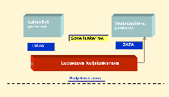
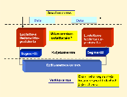

<text-box variant='learningObjectives' name='Oppimistavoitteet'>

- Osaat kuvata kuljetuskerroksen palvelujen toiminnan yleisellä tasolla.
- Tiedät mitä tarkoittavat segmentti ja lomitus. Osaat kertoa, mitä ne ovat ja miten lomitus toimii.

</text-box>

## Kuljetuspalvelu

Kuljetuspalvelun tehtävänä on huolehtia sen kuljetettavaksi annettu viesti lähettäjältä vastaanottajalle. Tämän kurssin edellisessä osassa ja aiemmalla kurssilla on jo käytä läpi sovelluskerroksen toiveita kuljetuskerrokselle.

<quizz id="quizzes/b5f5c343-90e6-46e4-aeed-f0889b401c49"> </quizz>

Kuljetuspalvelun keskeinen tehtävä on täyttää sovelluskerroksen toiveet ja vaatimukset, vaikka verkkokerros ei aina tue näitä.

Luotettavan kuljetuspalvelun keskeinen tehtävä on siis piilottaa verkkokerroksen epäluotettavuus sovelluskerrokselta:
* Sovelluskerros edellyttää kuljetuspalvelulta virheettömyyttä ja luotettavuutta, mutta verkkokerros voi muuttaa segmentin bittejä tai kadottaa koko segmentin
* sovelluskerros edellyttää järjestyksen säilymistä, mutta verkkokerros voi toimittaa segmentit epäjärjestyksessä
* sovelluskerros edellyttää kaksoiskappaleiden karsimista, mutta verkkokerros voi monistaa segmenttejä eli toimittaa useita kopioita samasta segmentistä
* sovelluskerros edellyttää mielivaltaisen pitkiä sanomia, mutta verkkokerros voi rajoittaa segmentin kokoa
* verkkokerros voi lisäksi viivyttää segmenttejä satunnaisen pitkän ajan,

## Mallinnuksesta

Kun mallinnamme tietoliikennejärjestelmän toimintaa, käytämme usein termiä kanava (engl. channel) kuvaamaan varsinaista tietoa siirtävää elementtiä. Kanava-termillä mallia ei sidota tiettyyn järjestelmään, vaan se sopii kaikkiin sellaisiin ympäristöihin, joissa kanavalle määritellyt ominaisuudet ovat samoja. Kanava on siis vain joukko ominaisuuksia, jotka kuvaavat miten tieto siirtyy lähettäjältä vastaanottajalle. Kanava voi esimerkiksi kadottaa viestejä, jolloin kaikki lähetetyt viestit eivät pääse perille. Kanava voi myös luvata toimittaa kaikki viestit virheettömästi perille. Mallin suunnittelija määrittelee kanavan ominaisuudet siten, että mallilla saadaan kuvattua haluttua toiminnallisuutta.

KUVA: Sovelluskerroksen näkökulmasta kuljetuskerroksen tarjoama kuljetuspalvelu on yhtenäinen luotettava kanava, johon lähettäjä laittaa viestin ja josta se sitten kulkee vastaanottajalle. Kanavassa kaikki viestit etenevät järjestyksessä ja pääsevät myös perille.

Kuljetuskerroksen kuljetuspalvelun näkökulmasta tilanne on paljon monimutkaisempi. Koska verkkokerros ei tarjoa luotettavaa siirtoa, on kuljetuspalvelun itse toteutettava tämä luotettava kuljetus epäluotettavan verkkokerroksen päälle. Tähän tarvitaan kuljetusprotokollaa, jonka pitää huolehtia kaikkien viestien perillemenosta oikeassa järjestyksessä ja oikealla sisällöllä, vaikka kanava sen alapuolella voi kadottaa, muuttaa, monistaa ja sekoittaa viestejä.

KUVA: Kuljetuspalvelun näkökulmasta verkkokerroksen tarjoama palvelu on epäluotettava kanava, joka voi muuttaa viestin sisältöä, kadottaa viestin, monistaa viestin ja vaihtaa viestien järjestyksen.

Kuljetuskerros siis piilottaa verkkokerroksen puutteita ja parantaa sovellukselle näkyvän palvelun laatua. Aivan kaikkea kuljetuskerros ei kuitenkaan pysty piilottamaan. Esimerkiksi viestien viivästymiset tai verkkoyhteyden katkeaminen ovat tilanteita, jolloin kuljetuskerros ei pysty välittämään viestejä ja näin ne välttämättä näkyvät myös sovelluskerrokselle.

Yksinkertaisissa mallinnuksissa ei tyypillisesti oteta kantaa viestien kulkuaikoihin vaan ainoastaan sisällön oikeellisuuteen ja järjestykseen. Yhteyden katkeaminenkin voidaan mallissa ajatella vain todella pitkäksi viivästymiseksi. Kun viivästyminen joskus päättyy, niin viestit kuitenkin pitää välittää sisällön ja järjestyksen mukaan oikein. Malliin on toki mahdollista ottaa mukaan myös aika, mutta tällä kurssilla otamme käyttöön vain ajastimet, emme varsinaisia aika-arvioita viestien kulkemisiin.

Seuraavassa aliluvussa käsitellään kuljetuspalvelun toimintaa ensin mallien avulla.

## Segmenttien lomitus

Yksi kuljetuspalvelun keskeisistä tehtävistä on saapuvien viestien toimittaminen oikealle sovelluskerroksen vastaanottajalle. Samassa koneessa voi olla samanaikaisesti useita prosesseja, jotka odottavat saapuvia viestejä.

Vastaanottovaiheessa linkkikerros poimii saapuvista viesteistä ne, jotka on sillä kerroksella osoitettu tälle koneelle. Se antaa nämä viestit verkkokerrokselle, joka tarkistaa verkkokerroksen tiedoista viestin varsinaisen vastaanottajan. Jos vastaanottaja ei ollut tämä laite, niin viesti reititetään kohti lopullista vastaanottajaa ja annetaan linkkikerrokselle toimitettavaksi eteenpäin. Kun verkkokerroksen mielestä vastaanottaja on tällä koneella, se antaa viestin edelleen kuljetuskerrokselle.

Kun kuljetuskerros saa viestin verkkokerrokselta, on kuljetuskerroksen selvitettävä, mille sovelluskerroksen vastaanottajalle viesti on oikeasti menossa. Jokainen verkkokerrokselta saapuva viesti on selvitettävä erikseen. Ne voivat olla menossa eri vastaanottajille.

Vastaavasti sovelluskerrokselta kuljetuskerrokselle tulevat viestit saapuvat eri kohteista ja lähetysvaiheessa ne voivat lomittua keskenään.

KUVA: Kuvassa A:n ja C:n sovelluskerroksen prosessit kommunikoivat keskenään porttien 2476 (A:lla) ja 3614 (C:llä) kautta. Vastaavasti B:n ja C:n sovelluskerroksen prosessit kommunikoivat keskenään porttien 1258 (B:llä) ja  5625 (C:llä) kautta. C:llä on siis kaksi sovellusprosessia (tai yksi, joka kommunikoi useamman portin kautta eri laitteissa olevien sovellusten kanssa), jotka käyttävät eri portteja ja kommunikoivat vastapuoliensa kanssa niiden välityksellä.

<quiz id="9631e51f-779a-4c8e-8837-c68b0f5bf08e"></quiz>

