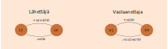
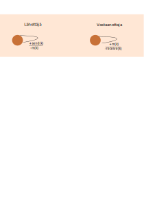
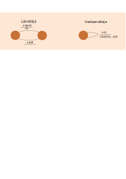
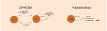
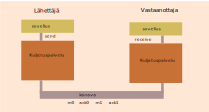
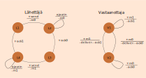

<text-box variant='learningObjectives' name='Oppimistavoitteet'>

- Osaat mallintaa yksinkertaisen protokollan toiminnan.
- Osaat arvioida protokollan toiminnallisuutta käsin simuloimalla mallia.

</text-box>

Tämä on kurssin teoreettisin osio. Käytä tähän riittävästi aikaa, jotta oikeasti ymmärrät protokollien suunnitteluun liittyviä periaatteita ja protokollien oikeellisuuden haasteita. Varsinainen äärellisten automaattien ja tilasiirtymäjärjestelmien taustalla oleva teoria käsitellään kurssilla Laskennan mallit. Protokollien verifiointia voidaan tehdä useilla erilaisilla menetelmillä, mutta niiden opiskeluun tällä kurssilla ei paneuduta.

## Protokollien mallinnuksesta

Protokollia voidaan mallintaa monella eri tavalla ja menetelmällä. Protokollien mallintamiseen on kehitetty useita erilaisia mallinnuskieliä. Tällä kurssilla tarkastellaan kuitenkin protokollien mallintamista yksinkertaisten [äärellisten automaattien](https://fi.wikipedia.org/wiki/%C3%84%C3%A4rellinen_automaatti) avulla. Näistä voidaan käyttää myös nimitystä tila-automaatti, koska niissä on tiloja ja tilojen välisiä tilasiirtymiä.  Automaatti pysyy yhdessä tilassa, kunnes tilasiirtymään liittyvän tapahtuman perusteella se siirtyy seuraavaan tilaan. Tilat ja tapahtumat voidaan nimetä tai numeroida vapaasti.

Tietoliikenteessä meidän täytyy mallintaa sekä lähettäjä että vastaanottaja, joten kyseessä on aina kahden automaatin yhteistoiminta. Lähettäjän ja vastaanottajan automaatit ovat aina jossain tilassa odottamassa tiettyä tapahtumaa, jonka seurauksena mallinnetun automaatin tila voi vaihtua seuraavaan. Yhdestä tilasta voi olla useita siirtymiä, joihin liittyy eri tapahtumat.

Tietoliikenteen tila-automaateissa tyypilliset tapahtumat ovat joko viestin lähetyksiä, jotka merkitään miinusmerkillä, tai viestin vastaanottoja, jotka merkitään plusmerkillä. Nämä merkinnät on helppo muistaa kun ajattelee, että sanoman lähettäminen vähentää jotain ja sanoman vastaanottaminen vastaavasti lisää. Tarvittaessa voidaan ottaa käyttöön myös muita tapahtumia, jotka ovat kyseisen protokollan toiminnan kannalta tarpeellisia, esimerkiksi ajastimen asettaminen ja/tai sen laukeaminen.

Tässä materiaalissa automaateissa ei ole merkittynä aloitustilaa vaan sen oletetaan olevan tila 1. Yleisesti automaattien aloitustila voidaan merkitä pienellä tähän tilaan johtavalla nuolella. Aloitustilalla on merkitystä, koska erityisesti tietoliikenteen automaattien kohdalla olemme kiinnostuneita niiden yhteistoiminnasta.

## Yksinkertainen kuljetuspalvelu (ei varaudu virheisiin)

Lähettäjällä kuljetuspalvelu saa sovelluskerrokselta välitettävän viestin (kuvassa +send) ja lähettää sen vastaanottajalle (kuvassa -m). Vastaanottajalla kuljetuspalvelu vastaanottaa viestin (kuvassa +m) ja toimittaa sen edelleen sovelluskerrokselle (kuvassa (-receive). Kuten huomaat, niin merkitsemme aina automaatin lähettämiä viestejä miinusmerkillä ja vastaanottamia viestejä plusmerkillä. Näin toimitaan, vaikka toinen osapuoli ei olisikaan tietoliikenneverkon takana. Tässähän send ja receive ovat tapahtumia, joiden avulla kuljetuspalvelu kommunikoi sovelluskerroksen prosessin kanssa. Olisimme voineet jättää myös sovelluskerroksen kommunikoinnnin pois, jolloin olisimme mallntaneet tilanteen, jossa lähettäjä vain lähettää ja vastaanottaja vain vastaanottaa. Kummallakin olisi ollut vain yksi tila ja siinä tilasiirtymä itseensä.  (Voit piirtää tämän yksinkertaisimman mahdollisen järjestelmän itsellesi paperille.) Tässä halusin kuitenkin pitää myös yhteyden sovelluskerroksen näkyvillä, koska se korostaa sitä, että kuljetuskerros välittää sovelluskerroksen viestejä.

KUVA: Kuljetuspalvelun tila-automaatti, kun kanava ei tee mitään virheitä. Tämä on siis ideaalisen kuljetuspalvelun tila-automaatti.

Koska tietoliikenteessä yleensä toiminnot liittyvät nimenomaan näihin tilasiirtymiin kahden tilan välillä, on tilasiirtymä mahdollista kirjoittaa automaattiin myös kaksiosaisena, jossa yläpuolinen osa on ehto siirtymän tekemiselle ja alapuolinen osa on toiminto, jonka automaatti tekee siirtymän aikana. Tällaisia automaatteja kutsutaan Mealyn automaateiksi (engl. [Mealy Machine](https://en.wikipedia.org/wiki/Mealy_machine)). Näin tilojen määrä saadaan pienemmäksi ja ehtona olevan tapahtuman (yleensä saapuva viesti) vaikutus näkyy minusta selkeämmin. Siksi käytän tätä merkintätapaa jatkossa.

Piirretään tuo edellisen kuvan automaatti uudelleen, mutta nyt tällä ehto/toiminto -siirtymällä. Tällöin sekä lähettäjälle että vastaanottajalle jää enää yksi tila.

KUVA: Lähettäjällä ja vastaanottajalla on kummallakin vain yksi tila ja siirtymä tästä tilasta itseensä. Lähettäjällä siirtymä on muotoa +send/-m ja vastaanottajalla muotoa +m/receive.

Tällainen kuljetuspalvelu toimii oikein vain, kun voimme luottaa siihen, että viesti m lähettäjältä vastaanottajalle menee aina perille ja että peräkkäiset viestit menevät perille samassa järjestyksessä kuin ne on lähetetty. Oletamme siis, että meillä on virheetön kanava, joka ei tee mitään virheitä viestin välitykseen. Koska todellisuudessa kanava ei ole näin luotettava, on kuljetuspalvelun toiminnassa otettava huomioon kanavan aiheuttamat ongelmat.

Huoma, että tässä yksinkertaisessa kuvauksessa mitään tietoa ei kulje vastaanottajalta lähettäjälle, joten lähettäjällä ei ole mitään keinoa varmistua viestien perillemenosta. Se voi vain luottaa alla olevan kanavan toimintaan.

## Yksinkertainen kuljetuspalvelu, jossa paketti voi kadota

Kun oletetaan, että viestejä kuljettava kanava voi kadottaa yksittäisen viestin, on kuljetuspalvelun varmistuttava siitä, että jokainen lähetetty viesti menee perille vastaanottajalle. Viestin vaurioituminen bittivirheistä käsitellään tässä mallissa kuin kadonnut viesti, koska yleensä viesti hylätään, jos se ei pääse virhetarkistuksesta läpi. Järjestelmä toipuu viestin katoamisesta yleensä uudelleenlähetyksellä. Sitä varten lähettäjän pitää kuitenkin tietää, miten tietyn viestin lähetys sujui. Tässä käytetään yleensä kuittauksia eli vastaanottaja lähettää kuittausviestin, jolla se kertoo lähettäjälle kyseisen viestin saapuneen perille. Kuittausviestistä lähettäjä saa vahvistuksen, että lähetetty viesti on saapunut onnistuneesti perille vastaanottajalle.

KUVA: Nyt lähettäjän pitää jokaisen viestin lähetyksen jälkeen vastaanottaa kuittaus (+ack) ennen kuin se voi lähettää seuraavan viestin. Vastaanottajakin lähettää kuittauksen jokaisen viestin vastaanoton jälkeen.

Molemmat automaatit aloittavat tilasta 1 eli eriteltyinä lähettäjä tilasta L1 ja vastaanottaja tilasta V1. Vastaanottajan automaatti voi tehdä tilasiirtymän vain saadessaan viestin m, joten se vain odottaa. Lähettäjän automaatti voi tehdä tilasiirtymän tilasta L1 tilaan L2, kun se saa viestin send. Jos siis mitään viestejä ei ole liikkeellä, niin kumpikaan automaatti ei voi vaihtaa tilaansa. Oletetaan siis, että sovelluskerrokselta tulee viesti send. Tällöin lähettäjän automaatti tekee tilasiirtymän tilasta L1 tilaan L2 ja lähettää sanoman m. Nyt vastaaanottajan automaatti voi vastaanottaessaan viestin tehdä tilasiirtymän tilasta V1 tilaan V1 ja lähettää viestin ack lähettäjälle ja antaa viesti sovelluskerrokselle (receive). Koska lähettäjän automaatti on tilassa L2, se voi tämän ack-viestin saatuaan siirtyä tilaan L1. Näin se pääsee taas käsittelemään seuraavaa send-viestiä.

Jos vastaanottajan lähettämä ack-viesti katoaa, ei lähettäjän tila-automaatti koskaan saa sitä eikä voi siirtyä pois tilasta L2. Ihan vastaavasti tapahtuu, jos lähettäjän lähettämä m-viesti katoaa. Tällöin vastaanottaja ei saa sitä, eikä voi lähettää viestiä ack.

Huomaa, että lähettäjä on viestin lähetettyään siirtynyt tilaan L2, eikä sillä ole mitään keinoa selvittää katosiko matkalla sen lähettämä viesti m vai vastaanottajan lähettämä kuittaus. Tämä periaate pätee kaikkeen tietoliikenteeseen, eli lähettäjä EI voi saada tietoa lähettämänsä viestin kohtalosta muuta kuin myöhemmin saapuvien (tai saapumatta jäävien) viestien välityksellä.

Tämä keskeneräinen malli ei siis vielä osaa toipua viestin katoamisesta.
Jotta toipuminen on mahdollista, niin meidän täytyy lisätä lähettäjän automaattiin mahdollisuus lähettää viesti uudelleen, jos kuittaus ei tule tietyn ajan kuluessa. Tämä voidaan tehdä yksinkertaisesti yhdellä lisäsiirtymällä ajastin/-m. Koska lähettäjä odottaa tietoa viestin kohtalosta nimenomaan tilassa L2, on viestin uudelleenlähetys liitettävä siihen tilaan. Ajastin aiheuttaa kellokeskeytyksen eli tapahtuman, johon automaatti voi reagoida. Ajastimista ja keskeytyksistä kerrotaan enemmän Tietokoneen toiminta -kursseilla.

Ajastimen avulla tehtyä aikakatkaisua (engl. timeout) käytetään siis tietoliikenteessä keskeyttämään lähettäjän odotus. Jos lähettäjän lähettämä viesti tai siihen liittyvä kuittaus katoaa matkalla, ei lähettäjä saa tästä mitään tietoa. Jotta lähettäjä voisi reagoida tähän katoamiseen, on lähettäjän viestin odotus ensin keskeytettävä [ajastimen](https://fi.wikipedia.org/wiki/Ajastin) avulla.  Viestin lähetyksen yhteydessä lähettäjä asettaa ajastimen tekemään keskeytyksen sopivan ajan kuluttua. Tästä olen näissä automaateissa oikaissut, eli niihin ei ole kirjattu tuota ajastimen asettamista lähetyksen yhteydessä, eikä myöskään ajastimen pysäyttämistä kuittauksen saapuessa. Automaatissa on vain ajastimen laukeamisen aiheuttama keskeytys (ajastin), koska se vaikuttaa automaatin toimintaan. Ajastimen asetus ja pysäytys olisivat vain lisätoimintoja viestin lähetyksessä (-m) ja kuittauksen vastaanotossa (+ack).

KUVA: Edelliseen kuvaan on lisätty ajastimen aiheuttama siirtymä ajastin/-m tilasta L2 tilaan L2.

Nyt yksittäinen viesti voi kadota ja ajastimen laukeamisen jälkeen lähettäjä voi lähettää viestin uudelleen. Protokollamme toimii oikein, jos kanava voi taata, että viesti menee varmasti perille tietyssä ajassa. Käytännössä kanava ei anna tällaista aikatakuuta, joten on mahdollista, että yksittäinen sanoma viivästyy niin paljon, että lähettäjä ehtii lähettämään sen uudelleen. Tällöin vastaanottaja saa saman viestin kahteen kertaan. Koska edellisen kuvan automaatissa vastaanottaja lähettää kuittauksen kaikille saapuneille viesteille, se kuittaa tämän viestin uudelleen. Tällainen tuplakuittaus voi aiheuttaa ongelmia.

Kun lähettäjä saa kuittauksen tilassa 2 se olettaa kuittauksen koskevan juuri lähettämäänsä viestiä. Jos kuittaus kuitenkin koski jotain aiempaa viestiä, saattaa juuri lähetetty, ja kadonnut, viesti jäädä pois välistä. Tämän korjaamiseksi meidän täytyy numeroida lähetetyt viestit, jotta lähettäjä tietää, mitä viestiä kuittaus koskee.

Teoreettisessa automaattien analysoinnissa usein edellytetään, että automaatille täytyy kuvata kaikki lailliset tilanteet. Jos jotain tilannetta ei ole kuvattu, niin automaatin toiminta päättyy virhetilaan. Meidän automaatissamme näin voisi käydä, jos lähettäjä saa kuittauksen tilassa L1, jossa se ei sitä odota saavansa. Tällä kurssilla kuitenkin oletamme, että automaatti vain ohittaa odottamattomat tapahtumat. Niitä ei siis jätetä odottamaan myöhempää käsittelyä, vaan automaatti vain purkaa ne pois käsittelyjonosta, kunnes tulee tapahtuma, jonka se osaa käsitellä. Tällä oletuksella saamme malleista vähennettyä siirtymiä tilasta itseensä.

<quiz id="eba8301a-3306-53eb-9bdc-64be4f6076b2"> </quiz>

Tämä yksinkertainen automaatti ei toimi oikein, jos viestien kulkuaika voi olla ajastimen laukeamisaikaa pidempi. Mieti hetki miksi näin on. Yritä kehittää tapahtumaketju, jossa yksi lähettäjältä lähtenyt viesti ei koskaan pääse perille, mutta muuten viestien kulku etenee normaalisti. Näin tapahtuu, kun kadotat lähetettyjä m viestejä sopivasti ja viivästytät yhden (tai useamman) ack-viestin siten, että se saapuu vasta ajastimen laukeamisen jälkeen. Tällainen ennenaikainan ajastimen laukeaminen (engl. premature timeout) sekoittaa tämän automaatin toiminnan. Korjaaminen edellyttää lähetettyjen viestien erottamista toisistaan, jolloin lähettäjä voi yhdistää kuittaukset oikeisiin lähetettyihin viesteihin.

## Vuorottelevan bitin protokolla

Jotta peräkkäiset viestit voidaan erottaa toisistaan, ne tyypillisesti numeroidaan ja kuittausviestissä kerrotaan sitten tämä viestin numero. Näin vastaanottaja voi havaita yksittäisen viesti katoamisen ja raportoida tästä lähettäjälle. Lähettäjä voi sitten lähettää tämän kadonneen viestin uudelleen. Koska haluamme pitää automaatin äärellisenä, niin emme voi käyttää ääretöntä viestien numerointia. Äärettömällä automaatilla olisi äärettömän monta tilaa ja sen analysointi olisi haastavaa.

Yksinkertaisimmillaan riittää, että numeroimme peräkkäiset viestit toisistaan poikkeavasti. Tähän riittää yksi bitti, jonka arvo on joko 0 tai 1. Kun näitä kahta arvoa vuorotellaan, saadaan kaksi peräkkäistä viestiä numeroitua toisistaan poikkeavasti. Tästä tulee tuo perinteinen nimi vuorottelevan bitin protokolla (engl. [alternating bit protocol](https://en.wikipedia.org/wiki/Alternating_bit_protocol)). Koska protokollalla lähetetään yksi viesti ja pysähdytään odottamaan sille kuittaus ennen seuraavan viestin lähetystä, käytetään protokollasta ajoittain myös nimitystä [stop-and-wait -protokolla](https://en.wikipedia.org/wiki/Stop-and-wait_ARQ). Tällainen viestin jälkeinen kuittauksen odottaminen on yleistä protokollissa, joten monet protokollat noudattavat stop-and-wait -mallia.

KUVA: Kaavakuvasta voi nähdä, minkä elementtien välillä viestit kulkevat.

Yllä olevassa kuvassa on piirrettynä seuraavan kuvan automaatin ympäristö. Tästä ja automaatin viesteistä näkyy, että lähettäjän päässä kuljetuspalvelu saa send-viestin sovelluskerrokselta. Vastaavasti vastaanottajan päässä kuljetuspalvelu toimittaa receive-viestin vastaanottajalle. Viestien kulkusuunta ei näy tästä kaavakuvasta, mutta se voidaan katsoa automaatin toiminnallisuudesta.

Jättämällä pois kommunikoinnin sovelluskerroksen kanssa, olisimme saaneet yksinkertaiseman mallin. Muista, että mallinnuksen vahvuus on juuri tällaisissa valinnoissa. Malliin otetaan mukaan vain ne toiminnat, joita halutaan tarkastella. Muu toiminnallisuus jätetään pois. Jos tästä mallista jätetään sovelluskerroksen viestit pois, niin silloin oletetaan, että lähettäjän päässä kuljetuspalvelulla on aina lähetettävää, jolloin viesti m0 tai m1 lähetetään aina, kun automaatti on sopivassa tilassa.

KUVA: Vuorottelevan bitin protokolla. Lähettäjän ja vastaanottajan välillä kanavassa kulkee siis normaalisti m0, ack0, m1, ack1, ....
 

<quiz id="46899944-668d-5ad5-8bad-00a1b1e22183"> </quiz>

Vuorottelevan bitin protokolla ei selvitä tilanteesta, jossa kanava voi vaihtaa lähetettyjen viestien järjestystä. Vuorottelevan bitin protokollassa normaalisti kanavassa on vain yksi viesti, jolloin kanava ei pääse vaihtamaan viestien järjestystä. Jos ajastin laukeaa silloin, kun viesti on vielä matkalla, on mahdollista saada kanavaan useampi viesti samanaikaisesti. Jos viestit menevät perille lähetysjärjestyksessä, niin protokolla toimii suunnitellulla tavalla. Jos kuitenkin viestit pääsevät vaihtamaan järjestystä, niin protokolla ei välttämättä enää toimi oikein. Se voi esimerkiksi jättää jonkun sovelluskerroksen viestin kokonaan välittämättä, mutta jatkaa toimintaansa tai se voi lukkiutua. Protokollien lukkiutuminen muistuttaa rinnakkaisten prosessien lukkiutumista (käsitellään käyttöjärjestelmät -kurssilla) sikäli, että lukkiutunut protokolla ei voi edetä koska kumpikin osapuoli odottaa toisen toimenpidettä. Jätämme lukkiutumisen käsittelyn myöhemmille kursseille.

Yritä sekoittaa protokollan toiminta viivästämällä viestejä ja vaihtamalla lähetettyjen viestien järjestystä. Näin opit hahmottamaan protokollien toimintaa yleisemminkin.
