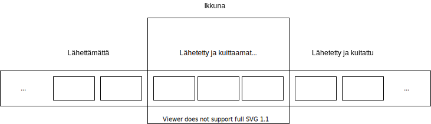

<text-box variant='learningObjectives' name='Oppimistavoitteet'>

- Osaat yleisellä tasolla kuvata liukuvan ikkunan periaatteen.
- Osaat perustella miksi liukuvan ikkunan käyttäminen tiedon siirrossa nopeuttaa sitä yksinkertaiseen pysähdy-ja-odota -malliin verrattuna.
- Osaat kuvata miten liukuvan ikkunan kanssa voidaan toipua viestien katoamisesta.

</text-box>

## Viestien liukuhihnoitus

Edellä käytiin läpi luotettavan kuljetuspalvelun teoriaa äärellisten tila-automaattien avulla. Saimme niillä kuvattua hyvin yksinkertaisen järjestelmän, jossa lähettäjä lähettää yhden viestin ja pysähtyy odottamaan kuittausta tähän viestiin. Tällainen pysähdy-ja-odota (engl. stop-and-wait) -protokolla on liian hidas todelliseen käyttöön, koska lähettäjän ja vastaanottajan välisen tiedonsiirron keston ajan lähettäjä vain odottaa. Tämän odotuksen kesto on noin kaksi kertaa yhdensuuntaisen paketin siirron kesto, koska sanoma kulkee lähettäjältä vastaanottajalle ja sitten kuittaus kulkee takaisinpäin. Tätä aikaa, joka viestin lähetyksessä kuluu viestin kulkuun edestakaisin, kutsutaan **kiertoviiveeksi** (engl. roundtrip time, RTT).

Yksinkertaisessa järjestelmässä, kuten vuorottelevan bitin protokolla, lähettäjä pysähtyy jokaisen paketin jälkeen odottamaan vastausta. Jolloin kahden peräkkäisen viestin välissä kuluu noin yhden kiertoviiveen verran aikaa. Tiedonsiirtoa voidaan nopeuttaa vain, jos saamme kahden peräkkäisen viestin lähettämisten välistä aikaa lyhyemmäksi. Kun kurssin alussa tarkastelimme viipeitä, niin havaitsimme, että lähetettävän datan pilkkominen pienempiin osiin nopeuttaa sen kulkemista verkossa, jos voimme lähettää kaikki palaset liikkeelle peräkkäin. Tarvitaan siis monimutkaisempi toteutus kuin yksinkertainen pysähdy-ja-odota. Toki voisimme yhden viestin sijaan lähettää vaikkapa 10 viestiä ja sitten odottaa niille kaikille vastaukset ennen seuraavan purskeen lähettämistä. Tällä saadaan jo viestintää nopeutettua,kun yhtä kierrosta kohti lähetetään enemmän dataa. Mallinnuksen ja algoritmien kannalta kyseessä on kuitenkin edelleen pysähdy-ja-odota -tyyppinen käyttäytyminen, koska lähettäjä odottaa vastausviestin kaikkiin lähetettyihin viesteihin, ennen kuin se lähettää lisää viestejä.

Jos viestien lähettäminen liukuhihnoitetaan (engl. pipeline) siten, että lähettäjällä voi olla N kappaletta viestejä odottamassa kuittausta ja lähettäjä voi aina lähettää yhden uuden viestin, kun se saa kuittauksen vanhimpaan lähetettyyn viestiin, niin päästään käyttämään liukuvan ikkunan mallia. Ikkuna kattaa täsmälleen ne viestit, jotka on lähetetty, mutta joille ei vielä ole saapunut kuittausta. Kun kuittaus saapuu, niin ikkuna siirtyy ja lähettäjä pääsee lähettämään uuden viestin. Tässä on tärkeää huomata, että järjestyksessä ensimmäinen (pienin numero, vanhin lähetetty) kuittaamaton viesti on aina ikkunan reunassa. Jo kuitatut viestit eivät siis enää ole ikkunassa, koska niistä lähettäjä tietää, että vastaanottaja on ne varmasti saanut.

KUVA: Lähetettävä data, joka on siis kolmessa ryhmässä. 1) Jo lähetetyt ja kuitatut viestin, 2) lähetetyt, mutta ei vielä kuitatut ja 3) lähettämättömät viestit. Näistä ryhmä 2 on se, joka on ikkunassa.

Liukuvan ikkunan (engl. sliding window) mallissa tavoitteena on, että lähettäjän ja vastaanottajan välillä on koko ajan liikkeellä viestejä ja kuittauksia siten, että lähettäjän ei tarvitsisi koskaan erikseen pysähtyä odottamaan kuittauksia. Luotettavan kuljetuspalvelun toteutus edellytti, että viestit menevät perille ja että ne menevät perille oikeassa järjestyksessä. 

Nyt kun matkalla on useita viestejä, on tärkeää numeroida viestit siten, että vastaanottaja voi tarvittaessa järjestää saapuvat viestit oikeaan järjestykseen. Vastaanottajan pitää siis voida havaita, jos joku viesti puuttuu välistä. Numeroimme viestejä äsken tuossa vuorottelevan bitin protokollassa, mutta meillä oli käytössä vain numerot 0 ja 1. 

Protokollien kanssa meillä on käytössä vain äärellinen määrä numeroita, joita sitten kierrätetään. Tässä on taustalla kaksi erilaista seikkaa jotka tähän johtavat. Protokollan toiminnan analyysissä äärellinen määrä tiloja on toivottavaa ja se johtaa äärelliseen numeroavaruuteen. Toinen ihan yhtä merkittävä seikka on se, että viestin numero on tyypillisesti osa otsaketietoja ja otsakkeessa selle voidaan varata vain äärellinen tila, mikä rajoittaa käytettävää numeroavaruutta. 

Esimerkiksi, kun meillä on käytettävissä vain kolmen bitin mittainen alue numerolle, niin voimme käyttää vain numeroita 0,1,..7 (eli meillä on 8 erilaista numeroa). Kun juuri lähetetyn viestin numero oli 7, niin seuraavan viestin numero on 0. Matemaattisesti käytämme siis [modulaariaritmetiikkaa](https://fi.wikipedia.org/wiki/Modulaarinen_aritmetiikka) eli luvun 8 jakojäännöksiä. Tätä merkitään usein mod 8.

## Liukuvan ikkunan toimintaperiaate

Ikkunan koko määrää sen, kuinka monta kuittaamatonta viestiä voi olla yhtä aikaa matkalla lähettäjältä vastaanottajalle. Lähettäjän ei ole pakko lähettää niitä kaikkia, mutta enempää se ei saa lähettää.

Ikkunan ulkopuolella voi jonossa olla lähetysvuoroa odottavia viestejä. Näitä ei ole vieä lähetetty, joten ne vasta odottavat lähetysvuoroa. Lähettäjä ottaa niitä järjestyksessä käsittelyyn sitä mukaan, kun lähetysikkunaan mahtuu. Tätä kuvataan myös ikkunan siirtymisellä näiden viestien kohdalle.

Ikkunasta jo poistuneista viesteistä ei olla enää kiinnostuneita, koska ne kuljetuspalvelu on saanut onnistuneesti siirrettyä lähettäjältä vastaanottajalle.

Kiinnostavin viesti on ikkunasta seuraavaksi poistuva viesti. Se on siis ikkunan reunassa ja sen lähettämisestä on kulunut pisin aika. Sitä ei ole vielä kuitattu, joten lähettäjällä ei ole tietoa, onko vastaanottaja saanut sen. Vasta kun kuittaus saapuu lähettäjälle voi kuljetuspalvelu olla varma siitä, että kyseinen viesti on onnistuneesti toimitettu perille ja vasta silloin ikkuna voi liikkua sen ohi.

Yksinkertaisella äärellisellä tila-automaatilla emme voi enää mallintaa liukuvan ikkunan -algoritmin toimintaa, koska tarvitsisimme juoksevan numeroinnin viesteille ja yksinkertaiset automaatit eivät osaa parametrisoituja viestejä. Siksi äskeisessä vuorottelevan bitin mallissakin meillä oli kaksi eri viestiä m0 ja m1. Sellaisen automaatin laatiminen, jossa olisi paljon enemmän viestejä ja paljon enemmän tiloja, on toki mahdollista, mutta ei ole enää mielekästä.  Vuorottelevan bitin mallia voidaan pitää yksinkertaisimpana mahdollisena liukuvan ikkunan järjestelmänä. Siinä ikkunan koko on yksi eli ikkuna on juuri sen viestin kohdalla, joka on lähetetty ja jonka kuittausta odotetaan saapuvaksi. Viestit on myös numeroitu moduloaritmetiikan mukaisesti numeroilla 0 ja 1 (mod 2), ja ne muodostavat ketjun 0,1,0,1,0,1,0,1, jne.

## Viestin katoamisesta toipuminen

Luotettavan kuljetuspalvelun ongelma on se, että sen käyttämä kanava on epäluotettava ja voi siis kadottaa viestejä, järjestää viestejä, vaurioittaa viestejä ja jopa monistaa yksittäisen viestin. Kuljetuspalvelun pitää selvitä näistä kaikista ongelmista.

Monistunut viesti on helppo, se pitää vain tunnistaa ja myöhemmin saapunut kopio jättää huomioimatta. Vastaanottajan pitää huomata viestien järjestyksen vaihtuminen. Kuljetuspalvelun vastaanottopään pitää antaa viestit eteenpäin oikeassa (lähetys)järjestyksessä, ei siis saapumisjärjestyksessä. Jos vastaanottajalla ei ole puskuria tallentaa väärässä välissä 'liian aikaisin' saapuneita viestejä, niin se joutuu ne kadottamaan, jolloin päädytäänkin kadonneen viestin ongelmaan. Vaurioitunut viesti voidaan käsitellä kadonneena viestinä, koska sisällön oikeellisuuteen ei enää voi luottaa. Kadonneen viestin osalta toipuminen edellyttää aina viestin uudelleenlähetystä.

Lähettäjähän voi havaita kadonneen viestin vain siitä, että siihen liittyvää kuittausviestiä ei tule. Tähän käytetään yleensä ajastinta, jolloin kuittausviestiä odotetaan vain tietty aika, tyypillisesti noin kaksi kertaa kiertoviiveen arvioitu kesto. 

Ajastimen laukeamisen jälkeen lähettäjä lähettää tämän kadonneeksi toteamansa viestin uudelleen. Mutta mitä pitäisi tehdä muille ikkunassa oleville jo lähetetyille viesteille? Lähettää nekin uudelleen, vai olettaa, että ne olisivat päässet perille ja vastaanottajalla on riittävä puskuri niiden säilyttämiseen odottamassa toimitusvuoroaan? Tähän ei ole yhtä ja ainoaa oikeaa vastausta.

Liukuvan ikkunan protokollassa uudelleenlähetys voidaan toteuttaa joko valikoivana uudelleenlähetyksenä (engl. selective repeat) tai koko ikkunan uudelleenlähetyksenä. Tätä koko ikkunan uudelleenlähetystä kutsutaan usein nimellä Paluu-N:ään (engl. Go-Back-N), koska ajatellaan, että meillä on lähetyskohdan ilmaiseva osoitin, joka siirretään, eli palautetaan, taaksepäin tuohon kohtaan N, josta lähettämistä jatketaan.

Menetelmän valinta voi riippua esimerkiksi siitä, kuinka iso ikkuna on, onko vastaanottajalla puskuria vai ei, tai siitä kuinka suuri kiertoviive on. Valinnassa pyritään aina löytämään optimiratkaisu eri seikkojen suhteen. Myös tietoliikenteen maksuperuste saattaa vaikuttaa asiaan. Jos jokaisesta siirretystä tavusta maksetaan, niin silloin kannattaa pitää siirrettävän tiedon määrä mahdollisimman pienenä. Jos maksetaan siirtoajasta, niin silloin sitä pitäisi yrittää minimoida. Lähettäjällä ja vastaanottajalla voi olla erilainen kustannus. Kiinteä maksu, joka ei ole suoraan sidottu siirrettävään datamäärään tai yhteyden kestoon, ei vaikuta uudelleenlähetysten kustannuksiin, jolloin liikennöintikustannusta ei tarvitse ottaa huomioon. Koska kiinteät kuukausimaksut ovat nykyisin hyvin tyypillinen tapa, niin jatkossa tietoliikenteen kustannuksia ei käytetä valintaperusteena. On kuitenkin hyvä muistaa, että tietyissä erikoistilanteissa silläkin voi olla merkitystä.

### Paluu-N:ään (Go-Back-N)

Paluu-N:ään on toiminnallisesti hyvin yksinkertainen. Kun vanhimpaan viestiin liittyvää kuittausta ei tule ajoissa, ajastin laukeaa ja lähettäjä lähettää kaikki ikkunassa olevat viestit uudelleen. Vastaanottaja lähettää kuittausviestin jokaisesta saapuvasta paketista, mutta kuitattavan viestin numero voi olla eri kuin saapuneen viestin numero.

Jokainen kuittaus kertoo lähettäjälle, että vastaanottaja on saanut kyseisen paketin lisäksi kaikki sitä edeltävät paketit. Tätä kutsutaan kumulatiiviseksi kuittaukseksi (engl. cumulative acknowledgement). Näin yksittäinen katoava kuittausviesti ei pääse aiheuttamaan massiivista uudelleenlähetystä. Huomaa, että kumulatiivisessa kuittauksessa yksi saapuva kuittaus voi kuitata useita paketteja. Tämän vuoksi vastaanottaja ei aina voi kuitata saapuvaa pakettia paketin omalla kuittausnumerolla vaan joutuu käyttämään viimeisimmän yhtenäisessä ketjussa aiemmin saapuneen paketin kuittausnumeroa.

Lähettäjän toiminnallisuus = tapahtumat, joihin pitää reagoida
* Viesti sovelluskerrokselta: Oletetaan, että meillä on ääretön puskuri, joten viesti lisätään lähetysjonoon. Tarkista, onko ikkuna täynnä (eli onko jo N kuittaamatonta viestiä). Jos ikkuna ei ole vielä täynnä, lähetä viesti vastaanottajalle. Jos ikkuna on täynnä, viestiä ei voi vielä lähettää.
* Kuittausviesti saapuu: Jos kuittaa jo aiemmin kuitattuja viestejä, niin älä tee mitään. Jos kuittaa uusia kuittaamattomia viestejä, niin siirrä ikkunan reuna ensimmäiseen kuittaamattomaan. Jos lähetysjonossa on lähetettävää, niin lähetä ne yksitellen, kunnes ikkuna on täynnä tai ei enää lähetettävää.
* Ajastin laukeaa: Oletetaan, että ajastimen laukeaminen liittyy aina ikkunan vanhimpaan viestiin, joten lähetä ikkunan sisältö eli kaikki aiemmin lähetetyt kuittaamattomat viestit uudelleen.

Vastaanottajan toiminnallisuus = tapahtumat, joihin pitää reagoida
* Vastaanottaja odottaa seuraavaksi viestiä, jonka järjestysnumero on N+1, koska se on jo toimittanut sovelluskerrokselle ja kuitannut kaikki viestit järjestysnumeroon N asti.
* Saapuu viesti, jonka järjestysnumero on oikein eli N+1: Lähetä kuittaus N+1 ja toimita viesti sovelluskerrokselle. (Kasvata odotettavan viestin järjestysnumeroa yhdellä.)
* Saapuu viesti, jonka järjestysnumero on väärin eli ei ole N+1: Lähetä kuittaus N. Viestin voi kadottaa.

Vastaanottajan on tärkeä kuitata kaikki saapuvat viestit, vaikka niillä olisi 'väärä järjestysnumero'. Tämä on tärkeää, koska vastaanottaja ei voi olla varma omien aiempien kuittaustensa perillemenosta. Näiden kuittausten tavoitteena on varmistaa, että lähettäjä saisi tiedon siitä, mihin asti vastaanottajalla on katkeamaton ketju jo toimitettuja viestejä.

Miksi vastaanottaja voi kadottaa väärässä järjestyksessä saapuvan viestin? Se voi luottaa siihen, että lähettäjä kuitenkin lähettää viestin uudelleen, jos ja kun edeltävä viesti on kadonnut. Näin sen ei tarvitse tallettaa puskuriin liian aikaisin saapuneita paketteja ja vastaanottajan toiminta on paljon yksinkertaisempaa. Se pitää tallessa vain tietoa siitä, mikä on seuraavaksi odotetun oikean paketin järjestysnumero. Toki on mahdollista, että vastaanottaja puskuroi paketteja, mutta silloin oikean paketin saavuttua sen pitää tutkia puskuria ja selvittää, kuinka monta pakettia se voi toimittaa sovelluskerrokselle puskurista. Kuittausviestissä menevä järjestysnumero muuttuu sitten tämän tiedon mukaisesti.

KUVA: Kuvassa on aikajanalla Paluu-N:ään toiminta, kun ikkunan koko on 4 ja paketti 2 katoaa. Kuvaan on piirretty se, mitkä viestit kulloinkin ovat ikkunassa ja mitä viestejä lähettäjän ja vastaanottajan välillä kulkee. Viestit on numeroitu 0:sta alkaen.

<quiz id="ffa8911b-7006-5b1c-9cbe-500bbfa4bf47">  </quiz>

### Valikoiva uudelleenlähetys (selective repeat)

Toinen vaihtoehto katoavien pakettien uudelleenlähetyksiin on lähettää vain kadonnut paketti uudelleen. Näin katoamistapauksessa lähetetään vähemmän paketteja, mutta pakettien ja niiden kuittausten hallinta on monimutkaisempaa kuin tuossa Paluu-N:ään vaihtoehdossa.

Lähettäjä lähettää yhden paketin uudelleen aina, kun kyseiseen pakettiin liittyvä ajastin laukeaa. Tällöin joko paketti on kadonnut tai kuittaus on kadonnut. Ajastin on protokollissa ainoa tapa, jolla lähettäjä voi havaita, että paketti täytyy lähettää uudelleen.

Kun käytetään valikoivaa kuittausta, niin lähettäjän saama kuittausviesti kuittaa aina vain kyseisen paketin. Vastaanottajan on siis kuitattava jokainen yksittäinen saapunut paketti silloinkin, kun se saapuu väärässä järjestyksessä. Vastaanottajan täytyy siis kuitata aina kaikki saapuvat paketit, myös sellaiset, jotka se on jo saanut aiemmin. Niiden kohdalla vastaanottaja olettaa kuittauksen kadonneen, joten sen täytyy lähettää kuittaus, vaikka se on sellaisen jo lähettänyt aiemmin.

Valikoivassa uudelleenlähetyksessa vastaanottajan on välttämätöntä puskuroida kaikki saapuvat paketit, koska lähettäjä ei välttämättä lähetä niitä enää uudelleen. Paluu-N:än kanssa puskurointi on vapaaehtoinen lisäpiirre, mutta tässä vaihtoehdossa siis pakollinen toiminnallisuus.

Puskurista muodostuu vastaanottajalle oma 'liukuvan ikkunan' näkymä saapuvien viestien jonoon. Vastaanottajan ikkunan reunassa on aina ensimmäinen puuttuva viesti. Ikkunassa voi pidemmällä olla jo saapuneita ja kuitattuja viestejä odottamassa tuon ensimmäisen viestin saapumista. Kun sitten ikkunan reunassa oleva odotettu viesti saapuu, niin ikkuna pääsee liikkumaan. Vastaanottajaa antaa saapuneita viestejä ikkunan reunasta sovelluskerrokselle ja ikkuna liikkuu kaikkien annettujen viestien ohi. Se pysähtyy taas, kun ikkunan reunassa on sellainen paketti, joka ei ole vielä saapunut. Huomaa, että tämä on enemmänkin meille ihmisille sopiva havainnollistamiskeino. Vastaanottajalla viestien puskurointi voi lisäksi vaikeuttaa se, että se ei etukäteen välttämättä tiedä, minkä kokoisia saapuvat paketit ovat. Se voi toimia vain jo saapuneen tiedon varassa. Numeroinnin avulla se havaitsee, että paketteja puuttuu.

Lähettäjän toiminnallisuus:
* Viesti sovelluskerrokselta: Oletaan, että lähetyspuskuriin mahtuu jonottamaan äärettömän monta viestiä. Jos ikkunassa on tilaa, niin viesti saa järjestysnumeron ja se lähetetään vastaanottajalle. Jos ikkuna on täynnä, niin viesti jää lähetyspuskuriin odottamaan lähetysikkunaan pääsyä.
* Ajastin laukeaa: Jokaisella viestillä on oma aikaraja ja ne tarvitsevat oman ajastimen. Ajastimen lauetessa vain kyseinen viesti lähetetään uudelleen. (Huom: jos laitteisto tulee vain yhtä ajastinta laitetasolla, niin sen avulla on kuitenkin mahdollista toteuttaa useita loogisia ajastimia ohjelmallisesti)
* Kuittausviesti saapuu: Kun kuittausviesti saapuu, kyseinen viesti merkitään kuitatuksi. Jos tämä on ikkunan reunimmainen, vanhin, viesti, niin siirrä ikkunaa eteenpäin  niin paljon, että ikkunan reunassa on taas ensimmäinen kuittaamaton viesti. Jos ikkunaan mahtuu ja jos lähetysjonossa on lähetettävää, niin lähetä ne yksitellen, kunnes ikkuna on täynnä tai ei enää lähetettävää.

Vastaanottajan toiminnallisuus:
* Huomaa, että vastaanottajan omassa ikkunassa on reunimmaisena pienin järjestysnumero, jonka saapumista vielä odotetaan. Merkitään tätä nimellä vastaanottaja-odottaa
* Saapuu viesti, jonka järjestysnumero on vastaanottajan ikkunassa eli suurempi tai yhtäsuuri kuin vastaanottaja-odottaa: Kuittaa viesti. Jos viesti oli ikkunan reunassa (eli juuri vastaanottaja-odottaa), niin siirrä vastaanottajan omaa ikkunaa ensimmäiseen puuttuvaan viestiin.  Toimita ikkunasta näin poistuvat viestit sovelluskerrokselle.
* Saapuu viesti, jonka järjestysnumero ei enää ole vastaaottajan ikkunassa, eli sen järjestynumero on pienempi kuin vastaanottaja-odottaa: Lähetä kuittaus. Itse viesti on jo käsitelty ja kuitattu aiemmin, mutta lähettäjä ei ilmeisesti tiedä sitä.

KUVA: Kuvassa on valikoivan uudelleen lähetyksen toiminta tilanteessa, jossa ikkunan koko on 4 ja viesteistä katoaa järjestysnumerolla 2 varustettu viesti.

<quiz id="6f276783-1e98-5fd7-8df2-a08042d7442e"> </quiz>

## Viestien numeroinnista

Liukuvan ikkunan protokollassa viestit täytyy numeroida siten, että tiedämme viestien järjestyksen ja kaksi viestiä ei voi koskaan mennä sekaisin. Kuten vuorottelevan bitin protokollasta huomasimme, tämän erottelun voi tehdä jopa vain yhdellä bitillä. Tietoliikenneprotokollien kanssa meillä on aina käytettävissä vain äärellinen numeroavaruus, koska yleensä protokollien otsakkeessa on varattu kiinteän kokoinen kenttä viestin numerolle. Jos kentän pituus on n bittiä, niin voimme erotella toisistaan 2n viestiä, joiden numerot ovat 0,1,2,3,... 2n-1.

Oletetaan esimerkiksi tilanne, jossa meillä on 4 erilaista numeroa eli 0,1,2 ja 3. Mikä voi silloin olla ikkunan maksimikoko, jotta emme voi sekoittaa viestejä? Missään tapauksessa se ei voi olla suurempi kuin 4, mutta voiko se olla edes 4? Jos ikkunan koko olisi suurempi kuin käytettävissä oleva numeroavaruus, niin ikkunassa olisi sama numero useampaan kertaan eikä lähettäjällä tai vastaanottajalla olisi keinoa erottaa näitä kahta viestiä toisistaan. Tarvittaessa piirrä itsellesi kuva ikkunasta tällaisella tilanteessa.

Itse asiassa pakettien numerointi, ikkunan koko ja protokollan yksityiskohtainen toiminta liittyvät läheisesti toisiinsa. Jos käytämme kadonneen paketin kohdalla toipumiseen Paluu-N:ään, niin silloin riittää, että ikkunassa olevat paketit voidaan erotella toisistaan ja juuri ikkunasta poistuneesta viestistä (jota vielä käytetään kuittausnumerona), koska lähettäjä lähettää aina kadonneen viestin lisäksi kaikki sitä seuraavat viestit uudelleen. Näin eri 'kierrosten' pakettinumerot eivät voi sekaantua toisiinsa.

Valikoivan toiston kanssa sekaantumisen vaara on merkittävä, jos meillä ei ole riittävää turvamarginaalia ikkunan ympärillä. Valikoivan toiston kanssa itse asiassa suurin sallittu ikkunankoko on korkeintaan puolet käytettävästä numeroavaruudesta. Tämä johtuu siitä, että toisaalta lähettäjä lähettää vain yksittäisiä puuttuviksi olettamiaan viestejä ja toisaalta vastaanottaja puskuroi aiemmin saapuneita viestejä. Nyt on mahdollista, että vastaanottaja on saanut viestin jo aiemmin, mutta kuittaus katosi. Tällöin lähettäjän pitää lähettää kyseinen viesti uudelleen. Jos nyt vastaanottajan ikkuna on liikahtanut eteenpäin, niin ilman tuota turvamarginaalia olisi mahdollista, että vastaanottaja olettaisi saapuvan viestin kuuluvan jo seuraavaan sarjaan.  Tarvittaessa piirrä itsellesi tapahtumakuvaus, jossa tällainen sekaantuminen pääsee tapahtumaan, kun ikkunan koko vastaa numerointia. Piirrä sen jälkeen vastaava tapahtumasarja tilanteessa, jossa ikkunan koko on puolet numeroavaruudesta ja vakuuta itsesi, miksi tässä tilanteessa ei vastaavaa voi tapahtua.

