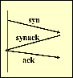
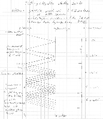

<text-box variant='learningObjectives' name='Oppimistavoitteet'>

- Osaat yleisellä tasolla kuvata TCP:n toiminnan.
- Osaat kuvata vuonvalvonnan ja ruuhkanhallinnan periaatteet.
- Osaat perustella, miksi TCP:n toiminnassa on erilaisia vaiheita ja kertoa miten vaiheesta toiseen siirtymien tapahtuu ja miksi.

</text-box>

## TCP:n toimintaperiaatteet

[TCP](https://fi.wikipedia.org/wiki/TCP) tarjoaa sovelluskerrokselle luotettavan päästä-päähän kuljetuspalvelun. Se siis siirtää sovelluskerrokselta saamansa datan sellaisenaan vastaanottajalle, kunhan lähettäjän ja vastaanottajan välillä on toimiva verkkoyhteys. Jos yhteyttä ei ole, niin viestit eivät kulje, eikä kuljetuspalvelu voi toimia.

TCP käsittelee sovelluskerrokselta tulevaa dataa (tai viestejä) itse asiassa yhtenäisenä tavuvirtana. TCP ei siis välitä sovelluskerroksen viestirakenteesta millään tavalla. Se vain siirtää tavuvirtapistokkeen kautta saamansa tavut vastaanottajalle, jossa ne päätyvät tavuvirtapistokkeen kautta sovelluskerrokselle. TCP pätkii tämän tavuvirran segmenteiksi, jotka se sitten siirtää verkkokerroksen välityksellä lähettäjältä vastaanottajalle.

KUVA: Kaavakuvassa on esitetty sovelluskerrokselta tulevan tavuvirran siirto kuljetuskerroksen TCP:n ja verkkokerroksen IP:n välityksellä. Huomaa, että kuvasta on jätetty selvyyden vuoksi pois muut kuin kuljetuskerroksen viereiset kerrokset. Katsotaan siis maailmaa sellaisena, kuin se näkyy kuljetuskerroksen TCP:lle.

TCP muodostaa yhteyden segmenttien siirtoa varten lähettäjän ja vastaanottajan välille. Yhteys muodostetaan, kun viestien vaihto alkaa ja puretaan, kun sitä ei enää tarvita. Yhteys on kaksisuuntainen (engl. full duplex), joten samaa muodostettua yhteyttä pitkin voi kuljettaa segmenttejä molempiin suuntiin. Tämä on käytännöllistä, koska yleensä verkkosovelluksella on tarvetta siirtää tietoa molempiin suuntiin.

Luotettava kuljetuspalvelu tarvitsee aina kuittauksia, jotta lähettäjä voi varmistua viestien perillemenosta. Perusmuodossaan TCP käyttää kumulatiivista kuittausta kuten äsken käsittelemämme Paluu-N:ään (Go-Back-N).

TCP:hen on vuosien varrella lisätty useita erilaisia piirteitä, jotka muokkaava ja laajentavat protokollan yksityiskohtia ja näin kasvattavat koko protokollan monimuotoisuutta. Tällä kurssilla käymme läpi vain hyvin yksinkertaisen perustoiminnallisuuden. Lisäpiirteitä voi sitten opiskella myöhemmin maisterivaiheen kurssilla [Internet Protocols](https://courses.helsinki.fi/en/csm13102).

Tiivistetysti TCP siis tarjoaa sovelluskerrokselle luotettavan, järjestyksen säilyttävän tavuvirran, jossa ei ole sanomarajoja. TCP käyttää tavunumerointia ja kumulatiivisia kuittauksia.

TCP pyrkii tukemaan tietoliikenneverkon ja vastaanottajan toimintaa käyttämällä sekä vuonvalvontaa että ruuhkanhallintaa. Niiden avulla varmistetaan, että lähettäjä ei pääse tukahduttamaan vastaanottajaa tai matkan varrella olevia reitittimiä.  Vuonvalvonnalla (engl. flow control) suojataan vastaanottajaa. Se kontrolloi, että lähettäjä voi lähettää korkeintaan sen verran kuin vastaanottaja pystyy vastaanottamaan. Ruuhkanhallinnalla (engl. congestion control) suojataan verkon reitittimiä, jotta paketteja ei katoaisi matkalla ylivuodon vuoksi. Ruuhkanhallinnalla pyritään lähettäjän lähetysnopeutta säätämään siten, että verkko pystyy välittämään kaikki lähetetyt paketit vastaanottajalle asti. Koska TCP käyttää liukuvan ikkunan protokollaa, niin näillä käytännössä säädetään vain ikkunan kokoa.

## TCP-segmentti

Wikipedian [TCP-sivulla](https://fi.wikipedia.org/wiki/TCP) on kuva TCP-kehyksestä, jota tällä kurssilla kutsutaan segmentiksi sen englanninkielisen nimen segment mukaisesti. En halua käyttää siitä termiä kehys, koska kehys-termiä käytetään kurssilla myöhemmin linkkikerroksen viesteistä. Yritän eri kerrosten eri nimityksillä auttaa kokonaisuuden hallinnassa. Kuten tästäkin esimerkistä huomaat, niin tietoliikenteen termistö ei ole kovinkaan vakiintunutta ja siksi on aina syytä varmistaaa termin merkitys siinä käyttöyhteydessä.

TCP-segmentissä on otsake (engl. header) ja dataosio. Otsakkeen rakenne määritellään tarkasti protokollan kuvauksessa. TCP:n otsakkeen pituus on vähintään 20 tavua eli 160 bittiä tai toisin sanoen viisi 32-bittistä sanaa.  Jotta viestin lähettäjä ja vastaanottaja voivat ymmärtää toisensa oikein on jokaisen bitin (tavun, sanan) merkitys sovittava.

Käydään nyt tavuittain läpi TCP:n otsake:
* tavut 0 ja 1: lähettäjän porttinumero (engl. source port)
* tavut 2 ja 3: vastaanottajan porttinumero (engl. destination port)
* tavut 4-7: järjestysnumero (engl. sequence number) tavunumerointina
* tavut 8-11: kuittausnumero (engl. acknowledgement number)
* tavut 12 ja 13: on käsiteltävä bitti kerrallaan, koska niihin on keskitetty kaikki tavua pienemmät kentät. Näistä löytyvät mm. kaikki yhden bitin kokoiset kentät, lipukkeet tai liput (engl. flag), jotka antavat oman tietonsa protokollan toimintaan. Jokaisen kentän paikka on määritelty hyvin tarkasti. Emme käy näitä kaikkia läpi, mutta osa (kuten ACK, SYN, FIN) tulee vastaan toiminnallisuuden kuvauksessa.
* tavut 14 ja 15: vastaanottajan ikkunan eli vastaanottopuskurin koko (engl. receive window)
* tavut 16 ja 17: tarkistussumma (engl. internet checksum)
* tavut 18 ja 19: kiireellisyystietoa (engl. urgent data pointer)
* Optio-osa: Tavussa 12 kerrotaan 4:llä bitillä, mikä on otsakkeen täsmällinen pituus sanoina. Minimipituus on 5 sanaa, mutta otsake voi siis olla pidempikin, jolloin tämä optio-osa kattaa pidemmän otsakkeen loput sanat. Huomaathan, että maksimipituus on 15, koska 4:llä bitillä voidaan ilmaista kokonaislukunumerot 0 - 15.

Loput segmentistä on sitten siirrettävää dataa.

Jokaisessa yhteydessä segmenteillä on maksimikoko. Tämä koko voi vaihdella verkon alempien kerrosten ominaisuuksien mukaisesti. Maksimikoolla pyritään välttämään sitä, että alemmat kerrokset joutuvat pilkkomaan kuljetuskerroksen lähettämän segmentin useammaksi paketiksi. Esimerkiksi, jos fyysinen yhteys on toteutettu Ethernet-verkkona, niin silloin segmentin maksimikoko on 1460 tavua, koska ethernetin maksimidata yhdessä kehyksessä on 1500. Tuo erotus 1500-1460 menee TCP:n omaan otsakkeeseen (20 tavua) ja verkkokerroksen IP-protokollan otsakkeeseen (myös 20 tavua).

Tarkistussummaan palataan seuraavassa aliluvussa UDP:n kohdalla.

## Tavunumerointi

TCP käyttää segmenteissään tavunumerointia. Tavunumeroille on otsakkeessa varattu tilaa yhden 32-bittisen sanan verran eli reilu 4 miljardia eri numeroa.

Otsakkeessa oleva järjestysnumero kertoo segmentin ensimmäisen tavun numeron. Näin ollen kahden peräkkäisen segmentin numeroissa on yhtä suuri ero kuin ensimmäisessä segmentissä on tavuja.

TCP-yhteys on kaksisuuntainen ja eri suuntiin liikkuvilla segmenteillä on omat järjestysnumeronsa, joilla ei ole mitään tekemistä keskenään. Yhteyden alussa segmenttien tavunumerointi voi alkaa ihan mistä numerosta tahansa.

Kuittausnumero kertoo aina sen, mitä tavua vastaanottaja seuraavaksi odottaa. Vastaanottaja siis kuittaa saaneensa kaikki tavut ennen tätä seuraavaksi odottamaansa tavua. Esimerkiksi, kun lähettäjä A lähettää segmentin, jossa on segmenttinumero 245 ja se sisältää 102 tavua, niin segmentissa kulkee tavujen 245 - 346 sisältämä data, yhteensä 102 tavua. Vastaanottaja B kuittaa tämän segmentin kuittausnumerolla 347 (eli 245+102), joka on sen seuraavaksi odottaman tavun numero.

Kun meillä on segmenttejä liikkeellä molempiin suuntiin, niin samassa viestissä voi kulkea sekä uutta dataa että toisen suunnan segmenttiin liittyvä kuittausnumero. Juuri siksi otsakkeessa on erikseen kentät järjestysnumerolle ja kuittausnumerolle.

KUVA: Kuvassa on pieni jakso A:n ja B:n välillä kulkeneest TCP-liikenteestä. Osa viestien numeroista ja kuittausnumeroista on jätetty pois, koska ne täydennetään seuraavassa tehtävässä. Huomaa, että kuvassa ei ole hyödynnetty liukuvaa ikkunaa, kuten normaalisti TCP-liikenteessä olisi.

<quiz id="74a9c88c-54fe-5e53-9526-f40af8f27084"></quiz>

Kuittaukset pyritään, aina kun mahdollista, lähettämään varsinaisen datasegmentin yhteydessä kylkiäisenä (engl. piggypacked). Näin vähennetään tarpeetonta tietoliikennettä.

Itse asiassa TCP sallii kuittauksen viivästämisen siten, että yksittäistä kuittausta saa viivyttää korkeintaan 500 millisekuntia ja vain yhden kuittauksen voi jättää pois välistä. Eli joka toinen segmentti on kuitattava välittömästi ja yhden segmentin kuittausta saa viivyttää korkeintaan puoli sekuntia.

Koska kuittausta saa viivyttää, niin lähettäjän aikakatkaisun viiveen pitää olla riittävän pitkä, jottei tapahdu ennenaikaista aikakatkaisua ja siihen liittyvää tarpeetonta uudelleenlähetystä. Toisaalta pitkä viive aiheuttaa sen, että todellisessa katoamisessa segmentin uudelleenlähetys tapahtuu hyvin pitkän ajan kuluttua.

TCP voi käyttää niin sanottua nopeaa uudelleenlähetystä (engl. fast retransmit), jolloin lähettäjä lähettää segmentin uudelleen jo ennen aikakatkaisua. Tässä lähettäjä käyttää apuna saapuvia kuittausnumeroita. TCP:ssä vastaanottaja lähettää kuittauksen vähintään joka toisesta segmentistä, vaikka siltä puuttuisi aiempia segmenttejä. Tässä kuittauksessa se kertoo, mikä on seuraavaksi odotettava tavu. Kaikki nämä puuttuvaa segmenttiä seuraavat segmentit kuitataan siis samalla kuittausnumerolla, joka on puuttuvan segmentin ensimmäisen tavun numero. Näin alkuperäinen vastaanottaja saa useita kuittauksia, jotka kaikki kuittaavat samaa odotettavaa tavua.

Näitä aiemman kuittauksen kuittausnumeron sisältäviä viestejä kutsutaan toistokuittauksiksi. Kun lähettäjä saa kolmannen toistokuittauksen, se lähettää segmentin uudelleen, vaikka ajastin ei olisikaan vielä lauennut. Huomaa, että kolmas toistokuittaus on itseasiassa neljäs saman kuittausnumeron sisältävä viesti. Ensimmäinen kuittaus ei ollut toistokuittaus ja toistokuittauksia pitää tulla kolme.

## Segmentin katoaminen

TCP käyttää liukuvan ikkunan menetelmää ja kumuloituvaa kuittausta. Jos varsinainen datasegmentti katoaa, niin se pitää lähettää uudelleen, koska muuten vastaanottaja ei voi saada dataa. Perusmuodossaan TCP käyttää Paluu-N:ään, mutta koska se tallettaa kaikki saapuvat segmentit puskuriin, niin on mahdollista, että kaikkia kadonnutta segmenttiä seuraavia segmenttejä ei tarvitse lähettää uudelleen.

Lähettäjän kannalta ei ole merkitystä katoaako varsinainen datasegmentti vai siihen liittyvä kuittaus, jos se ei saa tietoa asiasta ennen ajastimen laukeamista. Kun ajastin laukeaa, niin lähettäjä lähettää kyseisen segmentin uudelleen.

Sen sijaa TCP:n toiminnan kannalta on eroa sillä katoaako varsinainen datasegmentti vai kuittaus. Jos datasegementti katoaa, niin se on aina joka tapauksessa lähetettävä uudelleen, koska vastaanottajalla ei sitä ole. Sen sijaan, jos kuittaus katoaa, niin se ei välttämättä ole ongelma, kunhan seuraava kumuloituva kuittaus tulee riittävän nopeasti perille. Sehän kuittaa myös tuon segmentin, jonka oma kuittaus katosi.

Toisaalta, jos ajastin laukeaa ennen kuin kuittaus ehtii perille, niin lähettäjä lähettää segmentin uudelleen. Tällaista tilannetta kutsutaan ennenaikaiseksi aikakatkaisuksi (engl. premature timeout). Niitä pyritään välttämään käyttämällä riittävän pitkää aikakatkaisua ajastimessa. Tarpeettomat uudelleenlähetykset kuormittavat verkkoa.

TODO:  Pari kuvaa, jossa on a) kuittauksen katoaminen ja seuraavalla kuittaus,  b) kuittauksen katoaminen ja ajastimen laukeaminen. c) ennenaikainen aikakatkaisu  (Katso mallia kirjan kuvista 3.34 - 3.36  (eri segmenttinumerot, mutta vastaavat nuolet ok)

<quiz id="79211967-19ed-5396-9488-5c3e32b33239"></quiz>

## Yhteyden muodostus ja purku

TCP:n yhteyden muodostuksessa välitetään kolme viestiä ja siitä käytetäänkin usein termiä kolmivaiheinen kättely. [Kättelyksi](https://fi.wikipedia.org/wiki/K%C3%A4ttely_(tietoliikenne)) (engl. handshake) kutsutaan usein protokollan aloitusvaihetta, tai kokonaista protokollaa, eli kaikkia viestejä, jotka tarvitaan ennen kuin varsinaisen datan siirto alkaa.

Kättelyssä kulkee kolme segmenttiä SYN - SYNACK -ACK. Tuo viimeinen ACK voi myös kulkea jo ensimmäisen datasegmentin mukana.

KUVA: TCP:n kolmivaiheinen kättely yhteyttä muodostettaessa

Yhteyden muodostuksen voi aloittaa kumpi tahansa osapuoli. Muodostuva yhteys on kaksisuuntainen, joten segmenttejä voi joka tapauksessa lähettää kumpaankin suuntaan.

SYN ja ACK ovat TCP-otsakkeen bittikenttiä. Niiden arvo 1 tarkoittaa, että lähetettävällä viestillä on kyseinen toiminnallisuus. Koska aina TCP-viestien kohdalla lähetetään aina vähintään 20 tavua otsaketta, niin näissäkin viesteissä kulkee kaikki otsakkeen kentät. Porttinumerot kertovat mistä ja miten sovelluskerros ja kuljetuskerros kommunikoivat kummassakin päässä. SYN-viestissä kulkeva järjestysnumero kertoo, mistä numerosta viestin lähettäjä aloittaa segmenttien numeroinnin. Viestissä on yhden tavun verran dataa, jotta sen järjestysnumero eroaa myöhempien viestien järjestysnumeroista. ACK-viestissä on vastaavasti normaalien kuittaussääntöjen mukainen kuittausnumero eli seuraavaksi odotettavan tavun numero. SYNACK-viestissä on nämä molemmat.

Vastaavasti yhteyden purussa käytetään FIN ja ACK viestejä. Purkaessa täytyy molemmat suunnat purkaa erikseen. Tämä johtuu siitä, että toiseen suuntaan saattaa vielä olla liikkeellä viestejä, kun toinen suunta olisi jo valmis purkamaan. Jos tilanne sen sallii, niin toki purkaessakin FIN- ja ACK-viestit voi yhdistää, mutta tämä ei ole aina mahdollista.  Yhteys on siis kokonaan purettu vasta, kun molemmat suunnat on purettu. Koska purkamista on vaikea tehdä moneen kertaan, käytetään purkuvaiheen apuna usein ajastimia, joiden avulla yhteys saadaan siivottua pois, kun se on purettu. Näillä ajastimilla on usein tietoliikenteen näkökulmasta hyvin pitkä laukeamisaika esimerkiksi 30, 60 tai 120 sekuntia.

Koska palvelimilla on käytettävissään vain rajallinen kapasiteetti samanaikaisille TCP-yhteyksille, on hyvin tavallista yrittää palvelunestohyökkäystä siten, että hyökkääjä pyrkii sitomaan kaikki yhteydet, jolloin lailliset asiakkaat eivät saa palvelua. Tällaisia hyökkäystyyppejä on useita, mutta yksinkertaisin niistä on niin sanottu SYN tulva (engl. SYN flood). SYN-hyökkäyksessä hyökkääjä lähettää vain SYN-viestejä, jolloin palvelin ei saa yhteyttä kokonaan muodostettua, mutta joutuu kuitenkin varamaan sille resursseja.

## TCP:n vuonvalvonta

TCP:ssä lähettäjä ja vastaanottaja käyttävät puskureita ja liukuhihnoitusta.  Lähettäjä voi lähettää useita segmenttejä, jos vastaanottajan puskurissa on tilaa. Vastaanottajahan tallettaa saapuvat segmentit vastaanottopuskuriin ennen kuin se saa ne toimitettua sovelluskerrokselle. Koska puskurin koko on rajallinen, täytyy lähettäjän pitää huolta että se ei lähetä enempää dataa kuin mitä vastaanottajan puskuriin mahtuu. Lähettäjä siis pyrkii sopeuttamaan lähetysnopeutensa vastaanottajan kapasiteettiin. Tähän se käyttää vuonvalvontaa.

Vuonvalvonta määrää lähettäjän ikkunan koon se mukaan, mikä on vastaanottajan puskurin tilanne. Jokaisessa lähettämässään viestissä solmu kertoo, kuinka paljon sen puskuriin vielä mahtuu tavuja. Huomaa, että tämä tieto säätää ikkunan kokoa, kun taas saapuvat kuittaukset siirtävät ikkunaa.

<quiz id="4881968d-b126-5b96-a36d-ffd84ed52e9d"> </quiz>

Jos vuonvalvonta pudottaa lähettäjän ikkunan koon nollaan, niin lähettäjä alkaa lähettää yhden tavun kokoisia segmenttejä. Näillä se kyselee vastaanottajalta, joko on tilaa lähettää enemmän. Vastaanottajan täytyy nämäkin viestit kuitata normaalien kuittaussääntöjen mukaisesti. Vastaanottaja käyttää toistokuittauksia kertomaan, että tilaa ei ole. Se lähettää normaalin kuittauksen vasta, kun se voi samalla kertoa, että tilaa on vähintään yhdelle täydelle TCP-segmentille.

Miksi lähettäjän täytyy lähettää näitä yhden tavun kokoisia segmenttejä? Miksei lähettäjä voi vain odottaa? Näiden kysymysten taustalla olevia periaatteita olemme jo sivunneet useampaan kertaan tämän kurssin kuluessa. Kaikki kiteytyy yksinkertaisesti siihen, että jos lähettäjä vain jää odottamaan ja kaikki matkalla olevat kuittausviestit syystä tai toisesta katoavat, niin lähettäjällä ei ole mitään keinoa tietää, koska se voi lähettää seuraavan viestin. Siksi lähettäjän täytyy aktiivisesti kysellä vastaanottajalta, jotta se voi olla varma yhteyden toimivuudesta ja siitä, että se aikanaan voi saada tiedon vastaanottajan tilanteesta. Muistathan, että vastaanottaja ei ole aktiivinen. Se aktivoituu vain kun sille saapuu viesti, jonka se käsittelee ja jää sitten odottamaan seuraavaa viestiä.

## Ruuhkanhallinta

Ruuhkanhallinnan tavoitteena on pitää TCP:n segmenttien lähetysnopeus sellaisena, että viestien määrä ei ylikuormita verkon reitittimiä, vaan kaikki viestit voivat päästä perille.

Verkon hetkellinen kuormitus vaihtelee ja käytettävissä olevan kaistan nopeus lähettäjän ja vastaanottajan välillä voi olla paljon vähemmän kuin mihin lähettäjä ja vastaanottaja kykenisivät. Pelkkä vuonvalvonta ei huomioi verkon tilannetta. Verkko voi siis olla pullonkaula ja rajoittaa liikennöintinopeutta.

Verkon kuormituksen vaihtelu johtuu yleensä muista verkon käyttäjistä eikä sitä voi kunnolla ennakoida. Etappivälitteisessä verkossa kaikki lähettäjät joutuvat jakamaan yhteisten yhteysvälien kapasiteetin ilman yksityiskohtaisia sopimuksia tai rajoituksia.

Verkon reitittimillä ja muissa verkkolaitteissa on yleensä puskurit, joilla ne voivat hiukan tasata verkon eri osien nopeuseroja.
Kun puskuri kasvaa, yksittäisen viestin eteneminen verkossa hidastuu. Se joutuu jonottamaan yhä pidempään reitittimien puskureissa ennen kuin se lähetetään eteenpäin. Tätä käsiteltiin lyhyesti, kun kurssin alussa tarkasteltiin jonotusviivettä.

Jos kuitenkin jonkun verkkolaitteen puskurit täyttyvät, niin se joutuu pudottamaan saapuvia paketteja, koska sillä ei yksinkertaisesti ole tilaa vastaanottaa pakettia. Kun paketti katoaa, lähettäjä joutuu lähettämään sen uudelleen. Pakettien uudelleenlähetys kuormittaa lisää jo valmiiksi ylikuormittunutta verkkoa ja voi pahimmillaan johtaa siihen, että yhä enemmän paketteja putoaa verkosta matkalla. Lisäksi jonotusaikojen kasvaessa, paketin kulkuaika kasvaa ja siitä voi seurata, että lähettäjä lähettää uudelleen sellaisen paketin, joka on vielä matkalla verkon ruuhkatilanteen vuoksi. Tällaisetkin uudelleenlähetykset lisäävät verkon kuormaa ja hidastavat pakettien kulkua entisestään. Tästä syntyy valitettavan helposti itseään ruokkiva noidankehä, jossa kaikki lähettävät paljon paketteja, mutta mitään ei kuitenkaan pääse läpi. Reitittimet vain tekevät yhä enemmän turhaa työtä välittämällä paketteja, jotka joku muu reititin myöhemmin pudottaa puskurin täyttymisen vuoksi. Jos ylikuormitustilanne on kuitenkin päässyt syntymään, niin tärkeintä on, että lähettäjät eivät yritä korjata tilannetta lähettämällä lisää paketteja.

Tilanteesta voidaan toipua vain kun lähettäjä huomaa ongelman ja selkeästi hidastaa viestien lähetystä. Näin se omalta osaltaan antaa verkolle mahdollisuuden toipua tästä hetkellisestä ylikuormitustilanteesta. Miten lähettäjä sitten voi havaita tilanteen? Se joko päättelee tilanteen pakettien katoamisesta ja hidastumisesta tai se saa verkolta tietoa tilanteesta.

Verkko tai siis sen reititin voi kertoa ongelmasta joko erillisellä kontrolliviestillä tai merkitä läpikulkeviin viesteihin lisätietoa ruuhkasta. Erillisellä kontrolliviestillä se siis ilmoittaa lähettäjälle, että "Olen ylikuormittunut" tai "Tukehdun". Lähettäjän odotetaan sitten reagoivan tähän kontrolliviestiin. Jos reititin vain merkitsee välittämiinsä viesteihin tiedon ruuhkautumisesta, niin tämä tieto saavuttaa lähettäjän vasta, kun viestin alkuperäinen vastaanottaja lähettää tiedon ruuhkautumisesta alkuperäiselle lähettäjälle. Me emme tällä kurssilla tarkastele näitä ratkaisuja, vaan keskitymme vain lähettäjän omaan havainnointiin, joka toimii silloinkin, kun verkkolaitteet eivät osaa varoittaa ruuhkasta.

Keskitytään tässä siis yksinkertaiseen lähettäjän tekemään ruuhkanhallintaan. Koska kyseessä on lähettäjän omaan viestien lähetykseen liittyvä toimintaperiaate, niin eri kuljetusprotokollilla on hyvin erilaisia tapoja ratkoa omaa ruuhkanhallintaa. TCP:n ruuhkanhallinta sopii TCP:lle, mutta ei välttämättä kaikille muille kuljetusprotokollille. TCP:ssä on useita erilaisia ruuhkanhallintamenetelmiä, joista tässä tutustumme vain TCP Reno:on.

TCP:n ruuhkanhallinta tehdään säätämällä ruuhkaikkunan (eng. congestion window) kokoa. Ruuhkaikkuna ei ole sama kuin lähetysikkuna, vaikka ne molemmat säätävätkin kuittaamattomien viestien määrää. Tietyllä ajanhetkellä saa olla kuittaamatta korkeintaan min (lähetysikkunan koko, ruuhkaikkunan koko) eli näistä pienempi on aina määräävä.

Ruuhkaikkuna säätää kuittaamattomien viestien määrän lisäksi myös sitä, kuinka paljon lähettäjä saa kyseisellä ajanhetkellä kuormittaa verkkoa. Lähettäjän on itse pääteltävä oikea ikkunan koko, tietoa ei ole saatavissa mistään muualta. Päättely tapahtuu seuraavasti:
* jos uudelleenlähetysajastin laukeaa, verkossa on ruuhkaa -> pienennä ikkunan kokoa
* jos kuittaukset tulevat tasaisesti, verkossa ei ole ruuhkaa -> ikkunan kokoa voisi ehkä suurentaa

Ruuhkaikkunan koko muuttuu dynaamisesti tilanteen mukaan. TCP:n viestien lähetyksessä on eri vaiheita. Lähetyksen alussa, ns. hidas aloitus (engl. slow start), TCP kasvattaa ikkunan kokoa nopeasti, kunnes se törmää ruuhkaan. Silloin se pienentää ikkunan kokoa merkittävästi ja pyrkii jatkossa välttämään ruuhkaa. Ruuhkan välttely -vaiheessa (engl. congestion avoidance) TCP kasvattaa ikkunan kokoa hyvin maltillisesti.

KUVA: Kuvassa on esimerkki TCP:n segmenttien lähettämisestä silloin, kun yhdessä viestissä on 1KB eli tuhat tavua dataa, ikkunan koon kynnysarvo on 4 KB ja lähettäjän puskurin koko on riittävän suuri. Jaetaan lähetys kiertoviiveen mittaisiin jaksoihin. Ensimmäisessä jaksossa lähetetään ensimmäinen segmentti. Seuraavan jakson alussa, kun kuittaus1 äskeiseen segmenttiin saapuu voidaan lähettää kaksi segmenttiä, koska ikkunan koko 1 on pienempi kuin kynnysarvo 4. Kolmannen jakson alussa saapuu ensin kuittaus 2, josta aiheutuu kahden viestin lähettäminen. Nyt ikkunan koko on 3. Kun kuittaus 3 saapuu hetken kuluttua saman jakson aikana, niin ikkunan koko on edelleen pienempi kuin kynnysarvo, joten edelleen voidaan lähettää kaksi viestiä. Nyt ikkunan koko on kynnysarvon suuruinen ja protokolla siirtyy hitaasta aloituksesta ruuhkan välttelyyn. Tässä vaiheessa on lähetetty kaikkiaan 7 viestiä. Seuraavan jakson alussa saapuu kuittaus 4. Koska ollaan ruuhkavälttelyssä, niin kuittauksista 4-7 aiheutuu vain yhden segmentin lähettäminen jokaista kuittausta kohti. Lisäksi ruuhkavälttelyssä voidaan lähettää yksi lisäviesti jokaista kiertoviivejaksoa kohti. Lähetetäänkö se heti kuittauksen 4 vai vasta kuittauksen 7 jälkeen ei ole protokollan yleiskuvan kannalta merkityksellistä. Oleellisempaa on, että ruuhkavälttelyssä lähetetään vain yksi segmentti jokaista kuitattua segmenttiä kohti.

Hidas aloitus:
* Ihan aluksi ruuhkaikkunan koko on 1 - hidas siirtonopeus, koska vain yksi sanoma yhtä kiertoviivettä kohti
* Eksponentiaalinen kasvu - jokaista saapuvaa kuittausta kohti saa lähettää kaksi viestiä (ikkunan koko kasvaa yhdellä). Näin yhden kiertoviiveen aikana ikkunan koko kaksinkertaistuu
* Jatkuu kunnes ikkunan koko saavuttaa kynnysarvon

Ruuhkanvälttely:
* Alkaa heti kun ruuhkaikkunan koko saavuttaa kynnysarvon
* Lineaarinen kasvu - kasvata ruuhkaikkunan kokoa vain yhdellä yhtä kiertoviivettä kohti.

Kynnysarvon tarkoitus on siis toimia ennakkovaroituksena mahdollisesta ruuhkautumisesta ennen kuin lähetysnopeus on liian suuri. Kynnysarvo säätää vaiheita. Kun ruuhkaikkuna pienempi kuin kynnysarvo ollaan hitaassa aloituksessa ja ruuhkaikkuna kasvaa yhdellä jokaisesta saapuvasta uudesta kuittauksesta. Hitaan aloituksen aikana lähetettyjen viestien määrä kasvaa eksponentiaalisesti yhtä kiertoviijaksoa kohti, mutta kyseessä on hidas aloitus, koska yhden kiertoviivejakson aikana siirtyy kuitenkin vähemmän dataa kuin ruuhkanvälttelyssä. Kun ruuhkaikkuna on vähintään kynnysarvon suuruinen, niin ollaan ruuhkavälttelyssä ja ruuhkaikkunan koko saa kasvaa enää yhdellä yhden kiertoviiveen keston aikana.

Jos ajastin laukeaa ja tulee uudelleenlähetys, niin oletetaan, että verkko on pahasti ruuhkautunut. Ruuhkaikkunan kooksi asetetaan 1 ja toiminta jatkuu hitaalla aloituksella. Samalla uudeksi kynnysarvoksi tulee puolet sen hetkisen ruuhkaikkunan koosta (kynnysarvo = ruuhkaikkuna / 2).

Jos yksittäinen segmentti on kadonnut, niin vastaanottaja lähettää kuittauksia, joissa on saman kuittausnumero.  Yksittäisen paketin katoaminen voi liittyä ruuhkaan, mutta yhtä hyvin paketin siirrossa on saattanut tapahtua bittivirhe, jonka seurauksena paketti on vaurioitunut ja se on hylätty. Saapuvia toistokuittauksia voidaan käyttää ruuhkanhallinnan apuna. Koska kuittauksia edelleen saapuu, niin verkko pystyy vielä välittämään liikennettä, mutta voisi olla hyvä hiukan rauhoittaa tilannetta.

Kolmen saapuneen toistokuittauksen jälkeen lähettäjä aloittaa sekä nopean toipumisen (engl. fast recovery) että nopean uudelleenlähetyksen (engl. fast retransmit) ja lähettää puuttuvan segmentin. Samalla se puolittaa sekä ruuhkaikkunan koon että asettaa uuden kynnysarvon (kynnysarvo = ruuhkaikkuna / 2). Liikennöinti jatkuu ruuhkanvälttelyllä.

Internetistä löytyy paljon erilaisia graafisia kuvauksia ruuhkaikkunan koon elämisestä näiden virhetilanteiden mukaan. Esimerkiksi artikkelissa [Decreasing the Hybrid-ARQ bandwidth overhead through the Multiple Packet NAK (MPN) protocol](https://www.researchgate.net/publication/267554658_Decreasing_the_Hybrid-ARQ_bandwidth_overhead_through_the_Multiple_Packet_NAK_MPN_protocol) on hyvät kuvat ajastimen laukeamisesta otsikolla [TCP Tahoe](https://www.researchgate.net/figure/Scenario-in-TCP-Tahoe-where-congestion-control-reacts-to-a-timed-out-ACK-with-a-slow_fig2_267554658) ja kaksoiskuittauksista otsikolla [TCP Reno](https://www.researchgate.net/figure/Scenario-in-TCP-Reno-where-congestion-control-reacts-with-fast-retransmission-as_fig3_267554658).  Nämä Reno ja Tahoe kuvastavat erilaisia TCP:n ruuhkanhallintamentelmiä. Niitä on TCP:lle määritelty useita, mutta me olemme käsitelleet vain näitä kahta eli ajastimen laukeamista ja kaksoiskuittauksia.

## Ajastimen arvo

Edellä on vain sanottu, että lähetetään paketti uudelleen, kun ajastin laukeaa ja että ajastimen arvon pitää olla sopivan mittainen. Mikä on sopiva ajastimen arvo?  Liian lyhyt aiheuttaa tarpeettomia uudelleen lähetyksiä ja liian pitkä hidastaa toimintaa, kun uudelleenlähetykseen kestää kauan ja sinä aikana ikkuna ei voi edetä. Tarpeettoman pitkä ajastimen arvo voi myös pahentaa ruuhkaa, koska silloin lähettäjä pystyy täyttämään mahdollisesti isomman ikkunan verran verkkoa ennen kuin ajastimen avulla huomaa ruuhkatilanteen syntyneen.

Hyvä perussääntö ja paljon käytetty oletus on, että sopiva ajastimen arvo on noin kaksinkertainen kiertoviiveeseen verrattuna (ajastin = 2 * kiertoviive). Koska yhteyden alussa ei kiertoviiveen kestoa tiedetä, on TCP:n kuvauksessa määritelty ajastimen oletusarvoksi 1 sekunti. Tästä ja tuosta kaksinkertaisesta kiertoviiveestä seuraa suoraan jo aiemmin esillä ollut vaatimus, että kuittausta saa viivästää korkeintaan 500 millisekuntia.

Jos ajastin laukeaa, niin kaksinkertaistetaan aikaraja (ns. exponential backoff). Näin lähettäjä pyrkii välttämään tarpeettomia uudelleenlähetyksiä. Tarpeettomien uudelleenlähetystä välttäminen on tärkeämpää kuin mahdollinen toiminnan hidastuminen tarpeettoman pitkän ajastinarvon vuoksi.

Lähettäjä säätää ajastinarvoa saapuvien kuittausten avulla arvioidun kiertoviiveen perusteella. Edellistä arviota päivitetään uudella mittaustuloksella. Yksittäisen viestin lähetyksen ja sen kuittauksen saapumisen väli on tähän viestiin liittyvä kiertoviive. Eri viestien näin mitatut kiertoviiveet voivat olla hyvinkin eri suuruisia, siksi säätämistä tehdään jatkuvasti. Tämä mitattu kiertoviive, jolla arviota päivitetään, voidaan laskea joko jokaisen kuittauksen yhteydessä tai vähintään kerran yhden kierroksen aikana. Kierroksen kesto on yhden kiertoviiveen verran.

Näin ollen uusi ajastinarvo on TimeoutInterval = EstimatedRTT + 4* DevRTT, missä  
EstimatedRTT = (1-&alpha;)* EstimatedRTT + (&alpha;)* SampleRTT  ja  
DevRTT = (1-&beta;)* DevRTT + &beta;* |SampleRTT-EstimatedRTT|

* EstimatedRTT on kiertoviiveen arvio
* DevRTT kuvaa arvojen vaihteluväliä eli poikkeamaa
* &alpha; ja &beta; ovat painoja, joilla säädetään, kuinka paljon uusi arvo voi muuttaa edellistä arviota. Tyypillisest &alpha; = 1/8 = 0,125 ja  &beta; = 0,25

TCP:n yksityiskohtien harjoitteluun tarjolla itsenäisesti tehtäviä lisätehtäviä, jotka luentokurssilla ovat viikottaisia harjoitustehtäviä. Lisätehtävät ovat tarjolla vain ilmoittautuneille moodlessa eli ne on tarkoitettu kokeeseen valmistautumisen tueksi.

