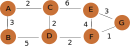
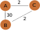

<text-box variant='learningObjectives' name='Oppimistavoitteet'>

- osaat kuvata reitityksen periaatteellisella tasolla
- osaat muutaman keskeisen reititysalgoritmin ja osaat laatia tarvittavat reititystaulut näitä algoritmeja käyttäen

</text-box>

##  Reititys ja reititysalgoritmit

Reitittimet käyttävät reititystauluja pakettien edelleenlähetykseen. Jotta reititystaulut pysyvät hyödyllisinä verkon arkkitehtuurin muuttuessa niitä pitää päivittää. Reitittimen oman reititystaulun päivittäminen on reitittimen vastuulla.  Koko verkon reittien suunnittelu eli reititys voidaan tehdä keskitetysti, jolloin reititin saa valmiin reititystaulun, jonka sen sitten ottaa käyttöön. Tällainen keskitetty reittien laskenta sopii erityisesti staattiseen reititykseen, jolloin reititys päätetään ennalta ja se ei sitten enää muutu. Toki sitä voidaan käyttää dynaamisemmin, jolloin keskitetysti lasketaan aika ajoin uudet reitit ja päivitetään ne reitittimille. Reititin käyttää sitten näitä reittejä, kunnes ne joskus päivitetään sille uudelleen. Reitittimen näkökulmasta tämä on hyvin staattista reititystä, koska se vain noudattaa saamansa reititystaulua eikä tee siihen muutoksia. Nykyisessä internetissä kaikkien reittien laskeminen keskitetysti veisi aivan liian paljon aikaa, jolloin reittimuutokset tapahtuisivat todella hitaasti. Nopeampi reititystaulujen päivitys onnnistuu vain hajautetuilla ja dynaamisilla reititysalgoritmeilla. Nämä algoritmit ovat hajautettuja, koska kaikki saman verkon reitittimet suorittavat kyseistä algoritmia ja vaihtavat tietoa (eli reititystauluja) toistensa kanssa. Ne ovat dynaamisia, koska reitittimet itse päivittävät oman reititystaulunsa.

Reititys voidaan suunnitella myös hierarkisesti, siten että aliverkkojen (eli autonomisten alueiden) välinen reititys ja aliverkkojen sisäinen reititys tehdään erikseen. Niihin voidaan käyttää jopa eri menetelmiä. Koska koko internetin tasolla aliverkot ovat itsenäisiä autonomisia, niin aliverkojen oma, sisäinen reititys on täysin aliverkon oma asia. Se voidaan tehdä millä tahansa aliverkolle sopivalla tavalla. Internetissä tyypilliset verkon sisäiset reititysprotokollat ovat [Routing Information Protocol](https://fi.wikipedia.org/wiki/Routing_Information_Protocol) (RIP) ja [Open Shortest Path First](https://fi.wikipedia.org/wiki/OSPF) (OSPF). Sen sijaan aliverkkojen välinen reititys, jolla siis huolehditaan viestin kulkeminen eri verkkojen kautta vastaanottajalle, tehdään  samalla tavalla kaikkialla. Internetissä tähän käytetään [Boarder Gateway Protocol](https://fi.wikipedia.org/wiki/BGP) (BGP) -protokollaa.   

Jätämme nuo internetin varsinaiset reititysalgoritmit niiden monimutkaisten yksityiskohtien vuoksi myöhemmille kursseilla. Tutustutaan nyt kahteen perusreititysalgoritmiin, jotka ovat useimpien algoritmien taustalla joko sellaisenaan tai muokattuna. Nämä kaksi reititysalgoritmia eroavat toisistaan erityisesti siinä, miten kattavan tiedon verkosta ja linkkien kustannuksista eli solmujen etäisyyksistä ne tarvitsevat.  Linkkitila-algoritmi (engl. link state algorithm)  tarvitsee täydellisen tiedon verkon rakenteesta, kun taas etäisyysvektorialgoritmille (engl. distance vector algorithm) riittää epätäydellinen kuva verkosta. 

Verkkoja ja verkkoalgoritmeja käsitellään laajemmin tietorakenteet ja algoritmit -kurssilla.

Algoritmien näkökulmasta verkko on sellainen tietorakenne, joka sisältää solmuja ja niiden välisiä yhteyksiä eli linkkejä. Tämä voidaan merkitä G=(N,E), missä G on verkko eli graafi, N on solmujen (engl. node) joukko ja E on linkkien (engl. edge) joukko. Lisäksi merkitään, että c(x,y) on solmujen x ja y välisen linkin kustannus (engl. cost). Linkin kustannus voi olla sen nopeus, kaistanleveys, ruuhkaisuus, rahallinen hinta linkin käytöstä, tai jotain muuta, jolla on numeerinen arvo. Näissä esimerkeissä linkin kustannus on siirron kesto tai hinta kyseisen linkin kautta.

Reititysalgoritmin tavoitteena on siis löytää nopeimmat tai halvimmat reitit solmujen välille. Reitti voi kulkea muiden solmujen kautta, kunhan se kokonaiskustannus on mahdollisista reiteistä pienin.

Käydään näiden algoritmien toiminta läpi esimerkin avulla.

KUVA: Kuvassa on esimerkkiverkko, jossa on 7 solmua ja näiden välillä kaikkiaan 9 linkkiä ja niiden kustannukset. Viestit kulkevat linkeissä molempiin suuntiin. Käytämme tätä verkkoa molempien algoritmien esittelyyn.

## Linkkitila-algoritmi

LInkkitila-algoritmi käyttää virittävää puuta reititystaulun muodostamisessa. [Virittävä puu](https://fi.wikipedia.org/wiki/Viritt%C3%A4v%C3%A4_puu) (engl. spanning tree) muodostaan kaikkien verkon solmujen välille yhteydet, siten että siinä ei enää ole syklejä. Tällaisia puita on useita, mutta reititystä varten pyritään löytämään minimikustannukset antava puu. Tähän minimikustannukset kuvaavaan puuhun valitut linkit muodostavat sitten reitityksessä käytettävät reitit solmujen välillä.
[Dijkstran algoritmi](https://fi.wikipedia.org/wiki/Dijkstran_algoritmi) tekee juuri tällaisen puun. Algoritmi ja sen toiminta on kvuattu tuossa wikipedian artikkelissa. Internetin reititysprotokollista OSPF käyttää Dijkstran algoritmia.

Käydään tässä läpi algoritmin toiminta äskeisessä kuvassa olleen esimerkkiverkkon kanssa, kun puun juureksi valitaan solmu A:
* juuri s= A; S=tyhjä; Q={A,B,C,D,E,F,G}; d[A]=0; d[muut] voivat olla tässä vaiheessa äärettömiä
* Kierros yksi: u= A; Q={B,C,D.E,F,G} (koska sen etäisyys itseensä on 0 eli lyhin kaikista etäisyyksistä)
* S={A};  d[B]=3; d[C]=2; previous[B]=A; previous[D]=A
* Kierros kaksi: u=C; Q={B,D,E,F,G} {Eli seuraava tarkasteltava on C, koska siihen lyhin etäisyys}
* S={A,C}; d[D]=2+2=4; d[E]=2+6=8; previous[D]=C; previous[E]=C
* Kierros kolme: u=B; Q={D,E,F,G} {koska d[B]=3 on pienempi kuin D[D]=4 tai muut etäisyydet}
* S={A,C,B}; (d[D] pysyy arvossa 4, koska 4 < 3+5)
* Kierros neljä: u=D; Q={E,F,G}
* S={A,C,B,D}; d[B] pysyy ennallaan; d[F]=4+2=6; pevious[F]=D
* Kierros viisi: u=F; Q={E,G}   (koska d[F]<d[E])
* S={A,B,C,D,F}; d[E] pysyy ennallaan 8 < 10; d[G]=6+1=7, previous[G]=F
* Kierros kuusi: u=G; Q={E} (koska d[G]<d[E], jos yhtäsuuret, niin valitaan jompi kumpi ilman tarkempaa sääntöä)
* S={A,B,C,D,F,G}; d[E] pysyy ennallaan
* Kierroksella seitsemän käsitellään viimeinen solmu G, mutta se ei aiheuta muutoksia tauluihin d tai previous
*

Algoritmin jälkeen meillä on etäisyydet d(A)=0; d(B)=3; d(C)=2; d(D)=4, d(E)=8, d(F)=6 sekä d(G)=7 ja previous(B)=A, previous(C)=A; previous(D)=C, previous(E)=C, previous(F)=D ja previous(G)=F. Simuloidessa tuon previous-taulun sijaan voin myös merkitä verkkopiirrokseen vastaavan linkin (kuten wikipedian kuvassa on tehty) Näistä voidaan sitten laatia reititystaulu A:lle

| kohde  | A lähettää solmun x suuntaan | kustannus |
|--------|----------------------| ----------|
| B  |  B  | 3 |
| C  |  C  | 2 |
| D  | C   | 4 |
| E  | C | 8 |
| F | C | 6 |
| G | C | 7 |

<quiz id="a68e9dfc-84a2-4634-8287-dc2c25be5fd3"> </quiz>

## Etäisyysvektorialgoritmi

Linkkitila-algoritmit tarvitsevat siis tiedon kaikkin linkkien kustannuksista ennen kuin algoritmia voidaan suorittaa. Niillä pitää siis olla niin sanotusta täydellinen kuva verkosta ennen suoritusta. Etäisyysvektorialgorimissa käsitys koko verkon linkkien kustannuksista saa olla epätäydellinen. Algoritmia voidaan siis suorittaa samalla kun selvitetään kauempana olevien verkon osien tietoja.

Etäisyysvektorialgoritmien perusajatus on, että jokainen solmu laskee itsenäisesti sen hetkisillä tiedoilla etäisyyksiä kaikkiin sen tietämiin solmuihin. Sitten se vaihtaa tiedot naapuriensa kanssa ja saa näin tietoonsa etäisyyksiä kauempana oleviin solmuihin.

Useimmat etäisyysvektoriin perustuvat reititysprotokollat kuten RIP käyttävät Bellman-Fordin algoritmia etäisyysvektorien laskennassa ja tietojen vaihdossa. Myös autonomisten verkkojen reitityksessä käytettävässä BGP protokollassa on muunnelma Bellman-Fordin algoritmista tai vähintäänkin BGP soveltaa vastaavia periaatteita.

[Bellman-Fordin algoritmissa](https://en.wikipedia.org/wiki/Bellman%E2%80%93Ford_algorithm) solmulla on aina oma etäisyysvektori, jossa on tiedot kustannuksista kaikkiin solmuihin. Kun solmu saa naapureiden vektorit, niin se päivittää omaan vektoriinsa kaikki etäisyydet, siten, että d[xy]=min(d[xy], c(xz)+d[zy]). Tällä kaavalla x päivittää oman etäisyydensä solmuun y. Etäisyys pysyy samana d[xy] tai vaihtuu pienemmäksi z:n etäisyys y:hyn d[zy] + x:n ja z:n välisen linkin kustannus x(xz). Tämä laskenta tehdään joka kierroksella jokaisessa solmussa kaikille etäisyyksille. Kun algoritmia on suoritettu korkeintaan solmujen lukumäärän verran, niin jokaisen solmun etäisyysvektoriin on varmasti päivittynyt pienimmät etäisyyden muihin solmuihin. 
 
 Nyt kaikki solmut päivittävät tietojaan joka kierroksella. Ne kaikki ylläpitävät omaa etäisyysvektoria distance=[A,B,C,D,E,F,G], jossa on siis solmun etäisyys kaikkiin muihin solmuihin. Tämän rinnalla niillä on tiedossa se, miltä solmulta tieto ko. etäisyyteen liittyen tuli. Eli previous -vektorissa on tieto solmusta z, jolle tämä solmu x lähettää kaikki solmulle y menevät viestit, koska c(xz)-d[zy] on minimi etäisyys xy, jonka x tietää.
 
Käydään siis tämän algoritmin toiminta läpi käyttämämme esimerkkiverkon kanssa:
* Kirjaan tähän vain solmun A tilanteen, muut solmut laskevat omia arvojaan vastaavasta joka kierroksella
* Aluksi A:n etäisyysvektori (distance) on [A 0,B 3,C 2,D -,E -,F -,G -] eli A tietää etäisyydet vain naapureihinsa
* Kierros yksi
* Tietojen vaihdossa A lähettää oman vektorinsa B:lle ja C:lle ja 
* saa niiden vektorit B:[A 3,B 0,C -, D 5,E -,F -,G -] ja C: [A 2,B -,C 0, D 2,E 6,F -,G -]
* A päivittää oman vektorinsa A:[A 0,B 3,C 2,D 4,E 8,F -,G -], koska D:lle min(-, 3+5, 2+2) =4, joten predecessor[D]=C ja E:lle min 8, predecessor[E]=C
* Kierros kaksi
* A lähettää oman vektorin ja saa B:ltä B:[A 3,B 0,C 5, D 5,E -,F 7,G -] ja C:ltä C:[A 2,B 5,C 0, D 2,E 6,F 4,G 9]
* A päivittää nyt oman vektorinsa A:[A 0,B 3,C 2,D 4,E 8,F 6,G 11], joten  predecessor[E]=C , predecessor[F]=C ja predecessor [G]=C
* Kierros kolme
* A lähettää oman vektorinsa ja saa B:ltä B:[A 3,B 0,C 5, D 5,E 11,F 7,G 8] ja C:ltä C:[A 2,B 5,C 0, D 2,E 6,F 4,G 5]
* A päivittää nyt oman vektorinsa A:[A 0,B 3,C 2,D 4,E 8,F 6,G 7] predecessor[G]=C
* Tämä jälkeen A:n vektorin tieto ei muutu ellei verkon linkkien kustannuksissa tapahdu muutoksia.

Huomaa kuinka A:n tieto reitistä ja ennenkaikkea etäisyydestä G:hen muuttui kierrosten kaksi ja kolme välissä. Tämä johtuu siitä, että tuo kustannuksiltaan lyhyin reitti A:lta G:lle on pidempi, joten se sai ensin tiedon lyhyemmästä reitistä ja vasta myöhemmin pidemmästä, mutta nopeammasta (tai edullisemmasta) reitistä.

Käytännössä, kun laskee käsin näitä reittejä, niin usein on helpointa tehdä kaikista solmuista ja niiden etäisyysvektoreista matriisi

| solmu | A | B | C | D | E | F | G | reitti (predecessor) |
|-------|---|---|---|---|---|---|---|--------|
| A:n vektori | 0 | 3 | 2 | - | - | - | - | B via B ja C via C |
|B:n vektori | 3 |0|-|5|-|-|-| A via A ja D via D |
| C:n vektori | 2 | - | 0 | 2 | 6 | - | - | A via A, D via D ja E via E |
| D:n vektori | - | 5 | 2 | 0 | - | 2 | - | B via B, C via C ja F via F |
| E:n vektori | - | - | 6 | - | 0 | 4 | 3 | C via C, F via F ja G via G |
| F:n vektori | - | - | - | 2 | 4 | 0 | 1 | D via D, E via E ja G via G |
| G:n vektori | - | - | - | - | 3 | 1 | 0 | E via E ja F via F |

Tässä tuntemattomat etäisyydet on merkitty viivalla, mutta yhtä hyvin merkintänä olisi voinut olla ääretön. Vastaavasti solmun etäisyys itseensä on merkitty 0:ksi.

<quiz id="aac1f4a7-87fa-4b62-9f30-e1b9a4357330"> </quiz>

Etäisyysvektorireititys on näppärä, koska reittitiedot etenevät suhteellisen nopeasti verkossa. Etappivälitteisessä verkossa viestit etenevät muutenkin vain linkkivälin kerrallaan. Nyt reititin päivittää oman tietonsa ja sitten lähettää sen eteenpäin. Tällöin aina kierros kierrokselta tieto eteen verkossa ja tunnetut reitit pitenevät. Vastaavasti myös kustannusmuutokset etenevät tällä samalla nopeudella verkon solmujen välillä. Tsstä käytetään joskus termiä "hyvät uutiset etenevät nopeasti" vastakohtana sille, että "huonot uutiset etenevät hitaasti".

Tarkastellaan tuota "huonojen uutisten hidasta etenemistä" pienessä esimerkkiverkossa. Tässä verkossa on vain kolme solmua ja ne on kytketty toisiinsa oheisen kuvan mukaisesti.  A:n ja B:n välinen liikenne kulkee C:n kautta, koska A:n ja B:n välisen yhteyden kustannus on suurempi.  

Nyt sitten, jos A:n ja C:n välinen yhteys hidastuu arvoon 20, jonka A huomaa ja toimittaa seuraavassa päivityksessä tiedoksi C:lle ja B:lle. niin etäisyysvektorialgoritmilla menee useita kierroksia ennenkuin tilanne rauhoittuu. Tätä tarkoittaa huonojen uutisten hitaus. Tarkastellaan siis algoritmin toimintaa ja solmujen reitityspäätöksiä eri kierroksilla.  Voit simuloida tätä itsekin ja huomaat kuinka solmut muuttavat etäisyyksien arvioita vain aina kahdella per kierros. Ne olettavat viestin kulkevan aina toista kautta, jossa etäisyys näyttää pienemmältä. Tämä pienin etäisyys kasvaa vain kahdella per kierros.

KUVA: Kuvan laskutoimituksista on huomattavissa miten B:n ja C:n etäisyysarvio A:han vuorottelee solmujen välillä ja kasvaa vain kahdella per kierros. Tätä jatkuu kunnes arvo vihdoin saavuttaa A:n etäisyysarviot.

Hyvien uutisten kanssa tieto eteni viestien mukana aina laajemmalle. Huonojen uutisten kanssa voi valitettavasti tapahtua kuten äskeisessä esimerkissä, että tieto muuttuukin vain vakiolisäykselle yhtä kierrosta kohti. Tällöin mitään varsinaista ylärajaa ei saada sille, koska järjestelmä on taas vakaassa tilassa ja kaikilla on oikea tieto verkon sen hetkisestä tilanteesta. Englanniksi tällaista tilannetta kutsutaan termillä count-to-infinity.

Äskeisessä esimerkiksi ongelmaksi tulee se, että ajoittain B ja C kuvittelevat nopeimman reitin A:lle menevän toistensa kautta samaanaikaan. Tällöin B lähettää A:lle menevät viestit C:lle ja C lähettää ne puolestaan B:lle. Nämä viestit eivät voi tavoittaa A:ta, koska kumpikaan ei lähetä niitä A:lle.

Tämä nimenomainen ongelma voidaan korjata sillä, että solmu 'valehtee' tietylle naapurille oman etäisyytensä äärettömäksi niihin solmuihin, jotka se reitittää kyseisen naapurin kautta. Näin solmu itseasiassa lähettää erilaiset etäisyysvektorit eri naapureilleen. Äskeisessä esimerkissä alkutilanteessa B lähettää A:lle vektorin B: (A 4, B 0, C 2), mutta C:lle vektorin (A -, B 0, C 2), koska se läehttää viestit A:lle C:n kautta. C lähettää saman vektorin sekä A:lle että B:lle, koska se ei reititä viestejä kummankaan kautta. Tällaista solmun tarkoituksellista valehtelua reitityssuuntaan kutsutaan englanniksi termillä poison-reverse.

Vaikka saimme tällä pienellä mutoksella katkaistua tässä esimerkissä tuon huonojen uutisten hitaan etenemisen, niin se ei ratkaise  kaikkia ongelmatilanteita.  (Esimerkiksi, jos otamme tähän kolmensolmun järjestelmään mukaan solmun D, jolla on yhteys vain solmuun B. Kn solmu D myöhemmin katoaa kokonaan verkosta A ja C aloittavat äskeistä esimerkkiä vastaavan pallottelun siitä mitä kautta ne D:n voivat tavoittaa. Koska kumpikin on lähettänyt viestit D:lle suoraan B:n kautta, niin tuon paluusuunnan asettaminen äärettömäksi ei auta.)

