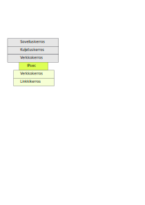

<text-box variant='learningObjectives' name='Oppimistavoitteet'>

- Tunnistat termin ICMP ja osaat yleisellä tasolla kertoa mikä se on
- Tunnistat termin IPsec ja osaat yleisellä tasolla kertoa mikä se on

</text-box>

## Muita verkkokerroksen protokollia

Edellä on käyty läpi verkkokerroksen tärkeimmän protokollan IP:n toiminnallisuutta. Verkkokerroksella on kuitenkin paljon muitakin protokollia. Englanninkielinen wikipedian sivu [Network_layer](https://en.wikipedia.org/wiki/Network_layer) luettelee niitä toistakymmentä. Tällä kurssilla tutustutaan niistä hyvin lyhyesti vain kahteen, jotka ovat vahvasti liitoksissa IP-protokollan kanssa. Kummankaan protokollan yksityiskohtaista toimintaa emme käy läpi. Se jää myöhemmille kursseille.

## ICMP

Internet Control Message Protocol (ICMP) on protokolla, jonka avulla verkon laitteet voivat välittää toisilleen tietoa verkon tilasta.

Ping ja traceroute käyttävät nimenomaan ICMP-paketteja verkon tilan selvittämiseen. Ping-komennolla voi kokeilla saavuttavatko paketit vastaanottavan koneen ja traceroute-komennolla voi selvittää, mitä reittiä paketit lähettäjältä vastaanottajalle kulkevat.

Reitittimet voivat käyttää ICMP-paketteja kertomaan lähettäjälle, jos reititin pudottaa IP-paketin siksi, että sen elinaika (time-to-live, TTL) päättyy eli laskuri menee 0:aan. Reititin voisi kertoa lähettäjälle myös muista pakettien pudottamisista, mutta reitittimen oman kuormituksen hallinnan vuoksi tätä ei juurikaan käytännössä tehdä.

Jos protokollan yksityiskohtaisempi toiminta kiinnostaa, niin englanninkielisellä wikipedian sivulla [Internet Control Message Protocol](https://en.wikipedia.org/wiki/Internet_Control_Message_Protocol) on kuvattuna tarkemmin protokollan erilaiset viestityypit ja niihin liittyvät koodit.

<quiz id="ab8b2c39-4327-5d98-a2de-b0e0c60198c8"> </quiz>

## IPsec

[IPsec](https://fi.wikipedia.org/wiki/IPsec) ei ole vain yksi protokolla vaan oikeammin protokollaperhe, kuten sen englanninkielinen nimi IP Security Architecture jo tavallaan kertoo.

IPsec on kehitetty huomattavasti itse internetiä myöhemmin ja sen tavoitteena on suojata IP-paketissa siirrettävä data salaamalla se. Vastaavaa palvelua tarjoaa kuljetuskerroksella TCP-yhteyksille [TLS](https://fi.wikipedia.org/wiki/TLS).

Virtuaaliset yksityisverkot (VPN) toteutetaan tyypillisesti juuri IPsec:llä. Silloin IPsec:iä käytetään tunnelointitilassa (engl. tunnel mode) ja alkuperäinen IP-paketti otsakkeineen on IPsec:llä salattava ja kuljetettava data. IPsec:llä salattu paketti sijoitetaan sitten tavalliseen IP-pakettiin, jonka otsakkeita ei tietenkään voida salata, kun IP-paketteja ei internetissä salata. Näin saadaan kuitenkin tunnelissa salattua tuo alkuperäinen paketti otsakkeineen, koska se on vain data tässä salatussa IP-paketissa. Tunnelissa kulkevan salatun paketin vastaanottaja ja lähettäjä ovat piilossa niin kauan kuin paketti on tunnelissa, mutta jotta paketti voidaan toimittaa lopulliselle vastaanottajalleen, niin salaus on purettava, jonka jälkeen alkuperäisen paketin otsakkeissa olevat lähettäjän ja vastaanottajan IP-numerot ovat taas luettavissa.

Tämä IPsecin suhde virtuaalisten yksityisverkkojen yhtenä toteutusvaihtoehtona on suurin syy protokollan suppeaan esittelyyn tällä kurssilla.

KUVA: Kuvassa on protokollapinon kerrokset, joiden väliin on sijoitettu myös IPsec tunnelointitilassa. IPsecin yläpuoliset sovellus-, kuljetus- ja verkkokerros ovat alkuperäisen IP-paketin mukaisia. IPsecin alapuoliset kerrokset puolestaan kohdistuvat IPsec:n tekemään uuteeen IP-pakettiin.

IPsec:iä voi käyttää myös kuljetustilassa (engl. transport mode), jolloin sen kuljettama data on kuljetuskerrokselta tullut segmentti. Tällöin salataan vain kuljetettava data, mutta otsaketiedot jäävät salaamatta. Protokolla sinänsä toimii samoin sekä tunnelointitilassa että kuljetustilassa, mutta sen oma data on erilainen. Kuljetustilassa sen data on TCP-segmentti, kun taas tunnelointitilassa datana on IP-paketti.

Koska IPsec käyttää salausta on sekä lähettäjällä että vastaanottajalla oltava jokin jaettu salaisuus, tyypillisesti salausavain (engl. encryption key) tai avainpari, jolla data voidaan lähettäjällä salata (engl. encrypt) ja vastaanottajalla taas purkaa (engl. decrypt) ennen salausta olleeseen "selväkieliseen" muotoon.  

Koska lähettäjällä ja vastaanottajalla on oltava sama symmetrisen salauksen avain, niin IPsec oikeastaan muodostaa yhteyden lähettäjän ja vastaanottajan välille, vaikka perinteisesti ja edelleen IP sinänsä on yhteydetön. IPsec tarjoaa useita erilaisia salausmenetelmiä, joten yhteyden aluksi lähettäjän ja vastaanottajan pitää sopia käytettävästä menetelmästä ja avaimista. Tätä varten ne muodostavat yksisuuntaisen loogisen yhteyden, jota kutsutaan englanniksi security association. Yhteys on yksisuuntainen, koska kun toimitaan verkkokerroksella, niin yksittäinen viesti kulkee aina vain yhteen suuntaan lähettäjältä vastaanottajalle. Jos viestejä pitää kuljettaa myös toiseen suuntaan, niin sitä varten pitää muodostaa oma looginen yhteys. 

Salaamalla siirrettävän datan (engl. encryption of payload) IPsec takaa sen muuttumattomuuden (engl. data integrity) ja varmentaa lähettäjän (engl. host authentication).  Nämä saavutetaan IPsecin protokollalla Authentication Header (AH). Jos lisäksi tarvitaan luottamuksellisuutta (engl. confidentiality), eli että muut eivät voi lukea datan sisältöä, niin silloin pitää käyttää Encapsulation Security Payload (ESP) protokollaa.

Turvallinen avaintenhallinta on aina keskeinen ongelma tiedonsuojaukseen liittyvissä salausjärjestelmissä. IPsec:ssä on erillinen avaintenhallintaprotokolla Internet Key Exchange (IKE), jonka avulla avaimista voidaan sopia turvallisesti ilman, että muut verkossa olevat laitteet pystyvät tunnistamaan kommunikoinnin osapuolia.  IKEn sijaan avaimet voitaisiin toki asettaa kommunikoiville laitteille käsin, mutta isommissa järjestelmissä laitteita on aivan liikaa tähän tarkoitukseen. 

Palataan vielä hetkeksi virtuaalisten yksityisverkkojen teemaan. Virtuaalinen yksityisverkko kahden aliverkon välillä voidaan siis toteuttaa IPsecillä siten, että tunnelointi tehdään aliverkkoja julkiseen verkkoon yhdistävissä reitittimissä. Pienimmillään toinen näistä aliverkoista voi olla käyttäjän tietokone ja suurimmillaan kyseessä voi olla ison organisaation koko sivukonttori. Toinen on tyypillisesti organisaation oma laaja verkko pääkonttorilla tai pääasiallisessa toimipaikassa. Tyypillisesti vain toisella aliverkolla on tunneloimaton yhteys internetiin.

KUVA: Kuvassa kaksi aliverkkoa on yhdistetty virtuaaliseksi yksityisverkoksi. Näitä verkkoja yhdistävät reitittimet toimivat yhteistyössä ja tunneloivat kaikki aliverkosta A lähtevät viestit aliverkkoon B. Huomaa, että kummastakin verkosta voi olla myös tunneloimattomia yhteyksiä internet-verkkoon, vaikka niitä ei ole tässä kuvattu.

<quiz id="54e15fff-16f3-5281-88a3-fdfaf553ba65"> </quiz>

Jos et saanut äskeistä tehtävää oikein, niin piirrä itsellesi alkuperäinen laitteen lähettämä IP-paketti ja sen jälkeen reitittimen lähettämä IP-sec paketti ja katso miten nuo lähettäjien ja vastaanottajien osoitteet menevät.

