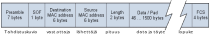

<text-box variant='learningObjectives' name='Oppimistavoitteet'>

- Osaat selittää linkkikerroksen toiminnallisuus (MAC- 
   osoitteet, bittivirheiden havaitseminen) ja ARP-protokollan 
   käyttö. 
- Osaat selittää yhteiskäyttöisen siirtokanavan varauksen ja käytön
- Osaat selittää, kuinka koneita voi yhdistellä lähiverkoiksi
- Osaat selittää reitittimen, kytkimen ja keskittimen erot 

</text-box>

## Linkkikerros

Linkkikerros huolehtii viestin välityksestä vain samassa aliverkossa olevien laitteiden välillä. Nämä laitteet voivat kommunikoida keskenään pelkän linkkikerroksen välityksellä. Verkkojen väliseen liikennöintiin tarvitaan reititystä ja reitittimiä. Muistathan, että reitittimet yhdistävät aliverkkoja toisiinsa, joten reitittimen kummallakin puolella on eri aliverkko ja siksi reitittimen täytyy lähetysvaiheessa muodostaa uusi linkkikerroksen kehys seuraavaa aliverkkoa varten.

Yhdessä aliverkossa olevat laitteet voivat havaita muiden saman aliverkon laitteiden lähettämän liikenteen, joten ne voivat suoraan vastaanottaa toisen laitteen lähettämän signaalin. Yhdessä aliverkossa on käytännössä vähintään kaksi laitetta, mutta laitteita voi olla useampiakin. Samaan aliverkkoon liitettävien laitteiden maksimimäärä riippuu käytettävästä verkkotekniikasta ja [verkon topologiasta](https://fi.wikipedia.org/wiki/Verkkotopologia). Esimerkiksi tähtiverkossa kytkimen porttien lukumäärä rajoittaa siihen liitettävien laitteiden lukumäärää. Väyläverkossa taas laitteiden fyysinen etäisyys tai oikeammin signaalin kulkuaika päästä päähän rajoittaa aliverkon kokoa. Renkaassa puolestaan rajoitteeksi tulee yhteen kierrokseen kuluva aika.

Wikipediassa on hyvä kuva erilaista topologioista: [https://fi.wikipedia.org/wiki/Tiedosto:Verkkotopologiat.png](https://fi.wikipedia.org/wiki/Tiedosto:Verkkotopologiat.png") 

* Väylässä laitteet littyvät vuorotellen samaan yhteen fyysiseen kaapeliin. Väylä on kuin jana, jolla on alkupiste ja loppupiste ja siinä välissä laitteita kiinni erikohdissa tätä janaa. Väylän laitteet voivat suoraan kommunikoida kaikkien muiden väylän laitteiden kanssa. 
* Tähdessä on keskipiste, johon kaikki laitteen yhdistyvät omilla johtimillaan. Tähden sakaroissa olevat laitteet voivat siis suoraan kommunikoida vain tähden keskipisteen kanssa, jonka pitää välittää viestejä sakaroiden välillä.
* Renkaassa laitteet on yhdistetty lyhyillä johtimilla suljetuksi ketjuksi. Rengas on kuin helminauha, jossa jokainen helmi on laite. Jokainen laite voi suoraan kommunikoida vain viereisten laitteiden kanssa. Viestin saaminen kauemmas renkaassa edellyttää, että matkan varressa olevat laitteet laittavat viestin eteenpäin.

Nykyisin tähtiverkko on ehkä kaikkein tyypillisin verkontopologia. Siinä verkon keskipisteessä on esimerkiksi linkkikerroksen kytkin, joka yhdistää verkon sakaroita toisiinsa. Yhdessä sakarassa on sitten reititin, jonka kautta tämä aliverkko on yhteydessä muualle. Kotiverkoissa usein kytkin ja reititin eivät ole erillisiä laitteita, vaan monitoimireititin toimii verkon keskipisteessä kotiverkon kytkimenä ja samalla reitittimenä ulkoverkon suuntaan. Tähtiverkkoja voidaan laajentaa useamman tähden kokoiseksi, kun yhteen sakaraan kiinnitetään toisen tähden keskipiste, kuten reititin, kytkin tai fyysisellä kerroksella toimiva keskitin tai toistin (engl. repeater).

## Linkkikerroksen tehtävät

Linkkikerroksen tehtävät liittyvät nimen omaan viestien siirtoon yhden fyysisen kerroksen yhteyden eli linkin yli. Linkkikerroksen pitää huolehtia, että kukin viesti pääse muuttumattomana linkin yli. Fyysisen kerroksen ominaisuuksista johtuen kanavassa voi kulkea vain yhden viestin tietoja yhdellä ajanhetkellä. 

Linkkikerroksen täytyy hallinoida lähettäjien vuorottelua kanavassa eli vuonvalvontaa. Vuonvalvonnan ratkaisut ovat erilaisia erilaisille fyysisille linkeille. Liikennöinti yhdessä linkissä voi olla yksisuuntaista (engl. half dublex) tai kaksisuuntaista (engl. full dublex), linkki voi olla langallinen tai langaton. Lisäksi kytkimet saattavat joutua puskuroimaan viestejä, koska osa kytkimistä osaa yhdistää samalla kommunikointitekniikalla toteutettuja eri nopeuksisia fyysisiä yhteyksiä toisiinsa. Esimerkiksi ethernet-kytkimessä voi olla nopeudeltaan sekä 10 Mb/s, 100 Mb/s että jopa 1 Gb/s portteja.

Viestin lähettäminen linkkiin ei siis saa häiritä mahdollisia muiden lähettämiä viestejä samassa linkissä. Tämä koskee erityisesti väylätopologiaa, jossa samassa kanavassa voi kulkea useiden eri lähettäjien viestejä. Koska viestit usein lähetetään sähköisinä signaaleina, jotka sekoittuvat toisiinsa helposti, on tärkeää, että kanavassa kulkee vain yhden lähettäjän viesti kerrallaan. Tällöin sanotaan, että lähettäjä on varannut kanavan omaan käyttöönsä. Tällaisia yhteiskäyttöisen kanavan varaamiseen liittyviä menetelmiä tarkastellaan hetken kuluttua aliluvussa lähetysvuorojen jakelu.

Linkkikerroksellakin vastaanottaja pitää tunnistaa, jotta viesti voidaan toimittaa oikealle vastaanottajalle. Tunnistamiseen tarvitaan vastaanottajan osoite. Linkkikerroksella tämä osoite on yleensä ethernet-verkon [MAC-osoite](https://fi.wikipedia.org/wiki/MAC-osoite), koska se on jo laitevalmistajan kyseiselle laitteelle etukäteen antama. Se on siis kiinteä laitteistoon liitetty osoite, joka alunperin ei voinut vaihtua. MAC-osoitteen 48 bittiä on jaettu kahteen osaan. Ensimmäiset 24 bittiä on laitevalmistajan tunniste ja jälkimmäiset 24 bittiä laitteen tunniste. Jokaisella valmistetulla laitteella, tai oikeammin verkkosovittimella, on oma maailmanlaajuisesti yksiklöivä tunniste.

Koska viesti ei saa muuttua matkalla on linkkikerroksen havaittava mahdolliset virheet ja tarvittaessa joko korjattava bittivirhe tai pudotettava paketti. Virheiden havaitsemisesta ja korjaamisesta on lisää seuraavassa aliluvussa.

## Osoitteen selvittäminen - ARP

Verkkokerroksella käytetty IP-osoite täytyy muuntaa MAC-osoitteeeksi, aivan kuten sovelluskerroksella käytetty laitenimi on muutettava IP-osoitteeksi.  IP-osoitetta vastaavan MAC-osoitteen selvittäminen onnistuu siihen tarkoitukseen suunnitellulla [ARP-protokollalla](https://fi.wikipedia.org/wiki/ARP_(protokolla)) (Address Resolution Protocol). 

Laitteen MAC-osoite on pysyvä (tai ainakin sen oletetaan olevan pysyvä). Sen sijaan laitteen IP-osoite vaihtuu ainakin silloin, kun laite vaihtaa yhden organisaation hallinnoimasta verkosta toisen organisaation verkkoon. MAC-osoitetta tarvitaan vain linkkikerroksella eli yhden aliverkon sisällä liikennöintiin. Aliverkon kannalta MAC-osoitteita ilmaantuu ja katoaa laitteiden mukana. 

Jokainen laite, joka toimii linkkikerroksen lisäksi myös verkkokerroksella, ylläpitää omaa ARP-väimuistia,  ARP-taulua, johon se kokoaa käyttämiään IP-osoite/MAC-osoite pareja. Taulussa on lisäksi jokaiselle osoiteparille oma voimassaoloaika, jonka kuluttua osoitemuunnoksen voi unohtaa. Tyypillinen voimassaoloaika on 20 minuuttia. Jos tietoa myöhemmin tarvitaan eikä muunnostieto enää ole ARP-taulussa, niin ARP-kysely on tehtävä uudelleen.

Huomaa, että laite selvittää vain samassa aliverkossa olevien laitteiden MAC-osoitteita, eli vain niitä osoitteita, jotka aliverkkopeitteen mukaan kuuluvat samaan aliverkkoon. Vain näille se voi lähettää viestejä suoraan linkkikerroksen avulla. Lähettäessään ARP-kyselyn se tietää, että laite, jonka osoitetta kysytään on samassa aliverkossa. Mietu miksi se voi tämän tietää!  (Vinkki: aliverkon peite).

ARP-protokollan mukaisesti kysely lähetetään linkkitason yleislähetysosoitteeseen, eli MAC-osoitteeseen FF-FF-FF-FF-FF-FF. Lähettäjä siis lähettää linkkikerroksen kehyksen, jossa vastaanottajana on yleislähetysosoite, lähettäjänä oma MAC-osoite ja datana kysytty IP-osoite ("Kenellä on tämä IP xx.yy.zz.vv?"). 

Kaikki verkon laitteet vastaanottavat tämän yleislähetysosoitteeseen saapuvan viestin. Jos viestissä on sisältönä laitteen oman IP-osoite, niin laite vastaa kyselyyn, jolloin lähettäjä saa vastauskehyksestä tietoonsa laitteen MAC-osoitteen.

Koska ARP-taulua käytetään väimuistina, niin kaikkien muiden välimuistien tapaan se on aluksi tyhjä. Tauluun siis lisätään tietoa sitä mukaan, kun laite saa näitä selville.

ARP-protokollaa käytetään vain IPv4-osoitteita vastaavien MAC-osoitteiden selvittämiseen. IPv6:lle määritelty Neighbour Discovery Protocol (NDP) tarjoaa vastaavan toiminnallisuuden IPv6-osoitteille.

ARP-protokolla on hyvä esimerkki siitä, että jotkut protokollat eivät oikein istu käyttämämme protokollapinon mukaiseen jaotteluun. ARP-prokolla luokitellaan välillä verkkokerroksen ja välillä linkkikerroksen protokollaksi. Se on selkeästi näiden kerrosten rajapinnassa, koska sen avulla voidaan saada kuvaus verkkokerroksen IP-osoitteen ja linkkikerroksen MAC-osoitteen välille. Vastaavia protokollia on muitakin. Kerrosmallin tarkoitus on lähinnä helpottaa asioiden ja kokonaisuuden hahamottamista. Jotta malli on saatu pysymään yksinkertaisena on vain ollut hyväksyttävä, että osa toiminnallisuuksista voi olla vaikea sijoittaa tiettyyn kerrokseen. 

## Linkkikerroksen toteutuksesta

Linkkikerroksen toteutus on oltava jokaisessa laitteessa, joka on liitettynä internet-verkkoon. Yleensä linkkikerroksen toiminnallisuus on toteutettu suoraan laitteistolla. Tietokoneessa on tyypillisesti erillinen verkkosovitin, joka muun tietokoneen kannalta on I/O-laite (Näistä tarkemmin Tietokoneen toiminta -kurssilla). Verkkosovitin liitetään tietokoneen päässä koneen sisäiseen väylään kuten muutkin I/O-laitteet. Tietoliikennekaapeli liitetään sitten verkkosovittimella olevaan liittimeen. Nykyisin verkkosovittimet on usein integroitu osaksi tietokoneen emolevyä, mutta aiemmin ne olivat erillisiä verkkokortteja, joita voi poistaa ja lisätä laitteeseen.  Verkkosovittimessa tai verkkokortissa on oma laiteohjain (engl. device controller), joka on usein toteuttu laitteisto-ohjelmistona (engl. firmware). Se huolehtii kaikista viestien lähetykseen ja vastaanottoon liittyvistä linkkikerroksen toiminnoista. Käyttöjärjestelmässä puolestaan on laiteajuri (engl. device dirver), joka huolehtii käyttöjärjestelmän ja laiteohjaimen välisestä kommunikoinnista.

Verkkosovittimen ja sen laiteohjaimen tehtävänä on siis huolehtia viestien lähettämisvaiheessa vähintään vuonvalvonnasta ja bittien koodaamisesta ja lähettämisestä fyysisen linkin edellyttämässä muodossa. Lisäksi sen tehtäviin kuuluu kuunnella kanavaa, tunnistaa itselle saapuvat viestit, vastaanottaa ne ja purkaa fyysisestä signaalista viestin bitit. Huomaa, että verkkosovitin ja sen laiteohjain kuulee kaiken kyseisessä johtimessa kulkevan liikenteen, mutta se suodattaa siitä vain itselle saapuvat viestit. Myös virhetarkistus kuuluu laiteohjaimen tehtäviin. 

Linkkikerroksella käytettävän siirtokehyksen (engl. frame) muodostaminen verkkokerrokselta saapuvan datagrammin ympärille voi olla joko laiteohjaimen tai laiteajurin tehtävä. Eli se voidaan tehdä joko laitteistolla tai ohjelmistolla. Tässä on vaihtelua eri toteutusten väilllä.
  

Kuva : Kaavakuva linkkikerroksen sijainnista

## Ethernet

Ethernet on tällä hetkellä yleisin lähiverkon toteutustekniikka. Se on tyypillinen kotiverkon teknologia, koska markkinoilla on tarjolla paljon monitoimireitittimiä, jotka tarjoavat ethernet-tekniikalla toteutettuja kaksipisteyhteyksiä reitittimen portin ja laitteen välille. Kaksipisteyhteys on yleenä toteutettu ns. ethernet-kaapelilla, joka nykyisin on tyypillisesti [parikaapeli](https://fi.wikipedia.org/wiki/Parikaapeli).

Ethernet on standardoitu. Itseasiassa sen toteutustekniikka ja nopeus on vuosien varrella muuttunut aina uuden standardin myötä. Tällä hetkellä tyypilliset verkot ovat 100 Mbit/s ja 1 Gbit/s. Wkipedian sivulla [Ethernet](https://fi.wikipedia.org/wiki/Ethernet) on hyvä tiivis kuvaus ethernetin eri versioista.

Ethernetin ensimmäiset versiot käyttivät koaksiaalikaapelia ja noudattivat väylätopologiaa. Näissä käytettiin liikenteen hallinnointiin Carrier Sence Media Access / Collision Detection (CSMA/CD) menetelmää, jossa lähettävän solmun piti ensin kuunnella (Carrier Sence), että väylä (Media Access) on vapaa ja sitten vielä lähetyksen aikana kuunnella, ettei mikään muu solmu lähettänyt samaan aikaan, ns yhteentörmäys (Collision Detection).  Tarkastellaan tämän menetelmän toimintaa tarkemmin osassa vuoronjakelu.

Tämä CSMA/CD on edelleen mukana myös myöhemmissä ethernet-toteutuksissa, joissa verkon topologia on tähti ja käytetään parikaapelia. Yhdessä parikaapelissa ei voi tapahtua yhteentörmäyksiä, koska kumpaankiin suuntaan on oma johdipari, eikä samassa johdinparissa ole muita lähettäjiä. Tähtiverkossa yhteentörmäyksiä voi tapahtua, jos tähden keskipisteenä on [keskitin](https://fi.wikipedia.org/wiki/Keskitin) (engl. hub) eikä kytkin tai reititin. Toisin kuin kytkin, joka toimii linkkikerroksella ja osaa tarvittaessa tilapäisesti puskuroida kehyksiä, keskitin toimii fyysisellä tasolla ja on vain moniporttinen toistin (engl- repeater), joka toistaa saapuvan liikenteen samantien kaikkiin muihin suuntiin. Keskitin onkin vain usean toistimen muodostama kokonaisuus ja usein näitä termejä käytetäänkin jopa synonyymeina. 

Kaikki ethernetin versiot käyttävät saman kokoista kehystä. Ethernet kehyksen alussa on ensin tahdistuskuvio, jolla vastaanottaja voi oman sugnaalinkäsittelynsä tahdistaa lähettäjän määräämään tahtiin. Siksi tahdistuskuvion 7 ensimmäistä tavua sisältävät vuorotellen bittejä 1 ja 0 eli yksi tavu on aina 10101010. Kuvion viimeistä 8. tavua voidaan kutsua kehyksen aloitukseksi (engl. start of frame, SOG) tai kehyksen alun rajoitteeksi (engl. start frame delimiter, SDF). 8. tavu muuten kuin aiemmat 7 tavua, mutta sen lopussa on kaksi ykköstä, joka kertoo vastaanottajalle, että seuraavaksi tulee kehyksen varsinaista sisältöä, josta ensimmäisenä vastaanottajan MAC-osoite. Sen jälkeen vuorossa on lähettäjän oma MAC-osoite, jota seuraa kahden tavun pituuskenttä. Joissakin ethernetin versioissa tämän pituuskentän arvoa käytetään välitettävän protokollan tyypin kuvaamiseen. Tätä kenttää seuraa varsinainen data-alue. Ethernet-kehyksessä siirrettävällä data-alueella on minimipituus. Jos siirrettävä data on sitä lyhyempi, niin silloin datan loppuun lisätään täytetavuja (engl. pad byte). Vastaanottaja osaa sivuuttaa nämä täytetavut. Kehyksen lopussa data-alueen jälkeen on vielä erillinen lopuke, jossa on 4 tavua CRC-menetelmän mukaan laskettuja tarkistusbittejä.

KUVA: Ethernet kehys

<quiz id="02d8e9f7-71de-5fa1-b5b9-e983d2d2b01d"> </quiz>

  

