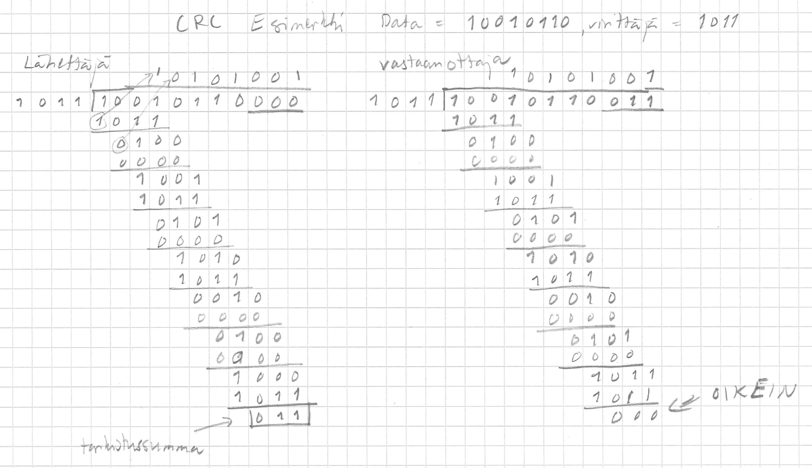

<text-box variant='learningObjectives' name='Oppimistavoitteet'>

- Osaat kuvata miksi tietoliikenteessä virheet ovat mahdollisia.
- Osaat kuvata virheen havaitsemisen ja korjaamisen periaatteet.
- Osaat mainita useita virheiden havaitsemiseen käytettyjä menetelmiä ja kuvata niiden tyypillisiä käyttötilanteita.
- Osaat kertoa UDP/Internet-tarkistussumman ja CRC:n toimintaperiaatteen ja jopa tarvittaessa toteuttaa pienen ohjelman, joka laskee tarkistussumman tällä periaatteella.

</text-box>

## Yleistä virheistä ja niiden havaitsemisesta

Koska tietoliikenteessä tietoa siirretään erilaisina signaaleina langallisesti tai langattomasti, niin signaalit voivat muuttua siirron aikana. Signaali saattaa vaimentua niin paljon, että vastaanottaja ei enää kykene luotettavasti erottamaan nollia ja ykkösiä toisistaan. Kanavassa voi myös olla muuta taustakohinaa, joka häiritsee vastaanottoa, esimerkiksi kaksi samanaikaista lähettäjää. Myös magneettikenttien vaihtelut ja jopa avaruudesta saapuvat hiukkaset ja säteily voivat muuttaa signaalin tasoja. Nämä muutokset voivat kohdistua vain yhteen bittiin tai useampaan peräkkäiseen bittiin, jolloin niitä usein kutsutaan virheryöpyksi (engl. burst).

Virheiden havaitseminen on vastaanottajan vastuulla, mutta lähettäjän pitää antaa sille riittävä informaatio, jotta virheen havaitseminen on mahdollista. Tätä varten lähettäjä lisää kehykseen tarkistustietoa tai tarkistusbittejä (engl. error detection and correction bits). Tämän tarkistustiedon avulla vastaanottaja voi tarkistaa, onko kehykseen tullut virheitä. Jos se havaitsee virheitä kehyksessä, niin se voi joko yrittää korjata virheen, hävittää kehyksen tai pyytää sitä uudelleen lähettäjältä. Nämä kaikki ovat aitoja vaihtoehtoja virheiden käsittelyssä, vaikka tietoliikenteessä varsin usein virheellinen kehys yksinkertaisesti hävitetään. Häviämisen havaitseminen on lähettäjän vastuulla, koska vain se tietää lähettäneensä kehyksen ja joutuu myös lähettämään kehyksen uudelleen.
  
Virheen havaitsemiseen tarvitaan siis lisäbittejä, joita voidaan tarkistusbitti -nimityksen sijaan kutsua tarkistussummaksi. Tarkistussummaan tutustuimmekin jo TCP ja UDP -protokollien yhteydessä. Samaa tarkistussummaa käytetään myös IP-otsakkeessa. Ethernet-kehyksissä käytössä on [Cyclic Redundance Check (CRC)](https://fi.wikipedia.org/wiki/CRC), joka on tehokkaasti toteutettavissa laiteistolla.

Vaikka kuljetuskerroksella on oma segmenttejä ja paketteja koskeva virhetarkistus, niin linkkikerroksella, ainakin ethernet-verkoissa, on oma virhetarkitus. Miksi ihmeessä virhetarkistuksia tehdään useammalla kuin yhdellä kerroksella? Yksinkertainen vastaus, koska muut kerrokset eivät tiedä, missä muualla virhetarkistuksia tehdään. Monimutkaisempi vastaus, eri kerroksilla on käytössä eri menetelmiä, joista osa tekee virhetarkistuksia ja osa ei, joten jos kyseinen protokolla haluaa varmistua siitä, että virhetarkistus toimii kaikilla eri yhdistelmillä, niin se joutuu tekemään sen itse. Vaikka tällä kurssilla tutustutaankin vain linkkikerroksen osalta ethernet-verkon toimintaan, niin todellisuudessa linkkikerroksella voi olla käytössä joku muu menetelmä, jossa ei ole virhetarkistusta. Vastaavasti linkkikerrokselle saattaa saapua siirrettäväksi sellaista dataa, jossa ei ole ylempien kerrosten virhetarkistuksia.

Tietokoneen toiminta -kurssilla tutustuttiin jo pariteettibitin käyttämiseen bittivirheen havaitsemisessa ja Hamming-koodin käyttämiseen bittivirheen korjaamisessa. Tästä jo havaittiin, että virheen korjaamiseen tarvitaan paljon enemmän bittejä kuin pelkkään virheen havaitsemiseen. Jos uudelleenlähetys ei ole vaihtoehto, niin silloin lähetykseen pitää liittää enemmän tarkistustietoa, jotta virheenkorjaaminen on mahdollista.

Teoreettisemmassa tarkastelussa virheen korjaaminen (engl. error correction) voidaan tehdä joko taaksepäin (backward) tai eteenpäin (forward). Uudelleenlähetys luokitellaan tässä taaksepäin tapahtuvaksi, koska järjestelmän toiminta tavallaan peruutetaan aiempaan toiminnallisuuteen. Vastaavasti sellaisen menetelmän käyttö, jossa paketti saadaan korjattua ja voidaan toimittaa edelleen kuuluu näihin eteenpäin tapahtuviin eli FEC-menetelmiin (engl. forward error correction).  Näitä menetelmiä ovat edellämainittu Hamming-koodi ja satelliittiyhteyksillä käytetty Reed-Solomon-koodi.

Tietoliikenteessä tyypillisesti, erikoistapauksia lukuunottamatta, tyydytään virheen havaitsemiseen ja tarvittaessa paketin hylkäämiseen / uudelleen lähetykseen. Näin tarvittavan tarkistustiedon määrä pysyy kohtuullisena. Ethernetissä noin 1500 tavua dataa sisältävän kehyksen tarkistustiedon koko on vain 4 tavua. Kun lisäksi valitaan laitteistolla tehokkaasti toteutettava koodaustapa, niin paketin siirron kokonaiskestoon ei tule kohtuutonta viivettä tarkistussumman laskennasta ja tarkistamisesta.

Koska virheet esiintyvät tyypillisesti ryöppyinä ja sekoittavat kehyksen sisällöstä enemmän kuin vain yhden bitin, eivät menetelmät, joilla havaitaan vain yksittäisen bitin vikaantuminen, toimi tietoliikenteessä. Esimerkiksi yksinkertaisella pariteettitarkistuksella on vain noin 50% todennäköisyys havaita viottunut paketti.  Vastaavasti se tulkitsee viallisen paketin samalla todennäköisyydellä oikeaksi. Jotta menetelmä olisi käyttökelpoinen paketin vioittuminen pitää havaita paljon luotettavammin.

Eri yhteyksillä virheiden esiintymistiheyksissä (engl. bit error rate, BER) on suuria eroja. Jos yhteydellä esiintyy paljon virheitä eli virheiden tiheys on suuri, niin lähetettävien kehysten kokoa kannattaa pienentää. Näin kasvatetaan todennäköisyyttä, että virhe ei osu kehykseen vaan ilmaantuu kanavalle joko ennen viestiä tai sen jälkeen. Suuri kehys on kauan siirtotiellä / kanavassa ja samalla kasvaa todennäköisyys, että kehykseen osuu bittivirhe tai virhepurske.

Linkkikerroksella ei käytetä kuljetuskerroksella käytettyä tarkistussummaa, jossa yhteenlasketaan 16 bitin kokonaisuuksia. Linkkikerroksen kannalta menetelmä ei ole kovin tehokas. Kyseinen menetelmä on kuvattuna kuljetuskerroksen yhteydessä eikä sitä siksi toisteta tässä.

## CRC

Ethernet käyttää polynomien avulla laskettua tiivistettä tarkistussummana kehyksen virheiden havaitsemiseen. Tämä [CRC-menetelmä](https://fi.wikipedia.org/wiki/CRC) (engl. cyclic redundancy check, CRC) on varsin luotettava menetelmä virheiden havaitsemiseen. Lisäksi se on helppo toteuttaa laitteistotasolla. CRC tunnetaan myös nimellä polynomikoodi (egl. polynomial code), koska se perustuu polynomien aritmetiikkaan. 

CRC:ssä bittijono tulkitaan 2-kantaiseksi polynomiksi, jossa siis kertoimet ovat vain 0 tai 1. Eli bittijono 101110 voidaan kirjoittaa polynomina 1\*x^5 + 0\*x^4 + 1\*x^3 + 1\*x^2 + 1\*x^1 + 0\*x^0 eli lyhyemmin x^5 + x^3 + x^2 + x^1. Huomaa että \* on kertomerkki ja  ^ on potenssiin korotus. Itseasiassa olemme jo tottuneet käsittelemään bittijonoja polynomeina, koska jos laskemme tämän polynomin arvon arvolle x=2, niin saamme binäärilukua 101110 vastaavan 10-järjestelmän luvun 2^5 + 2^3 + 2^2 + 2^1 = 32 + 8 + 4 +2 = 46.

Koska CRC käyttää polynomiaritmetiikkaa ja erityisesti polynomien jakolaskua, niin lähettäjän ja vastaanottajan täytyy sopia jakolaskussa käytettävästä jakajasta. Tästä jakajasta käytetään nimitystä virittäjäpolynomi (engl. generator polynomial). Polynomien jakolaskun jakojäännös muodostaa tarkistusbitit sanomalle. Lähettäjän pitää siis jakolaskussa selvittää tarkistusbittien arvo. Tarkistusbittejä laskettaessa jakajana on siis virittäjäpolynomi ja jaettavana on alkuperäinen data, jota on pidennetty tarkistusbittien verran lisäämällä (katenoimalla) datan loppuun oikea määrä nollia. Matemaattisena kaavana tämä voidaan ilmaista D\*2^r XOR R, missä D on alkuperäinen data, R on tarkistustieto ja r on tarkistustiedon bittien lukumäärä. Lähettäjällä tarkistusbitit R on siis nollia. Vastaanottajalla R on vastaavasti sanoman mukana saapuneet todelliset tarkistusbitit.

Laitteistolla tehtävän laskennan yksinkertaistamiseksi CRC:ssä jätetään yhteen- ja vähennyslaskuista pois muistinumero (engl. carry) ja lainaus. Näin itseasiassa käytämmekin yhteen- ja vähennyslaskujen sijaan XOR-operaatiota. CRC:n jakolaskussa poikkeaa tavallisesta jakolaskusta, kun erotus lasketaan XOR-operaatiolla vähennyslaskun sijaan.

<quiz id="fd60fd83-4fdc-50a4-a9ec-9f9e4d89765b"> </quiz>

Tällä kurssilla ohitetaan matemaattiset perustelut sille, miksi CRC toimii hyvin virheiden havaitsemissa. Jos aihe kiinnostaa, niin wikipediasta löytyy artikkeli [Mathematics of CRC](http://en.wikipedia.org/wiki/Mathematics_of_CRC), jossa on kattavasti kerrottu menetelmän matemaattiset perusteet.

Erikseen on vielä sovittu, että virittäjäpolynomin merkitsevin bitti on aina 1 eli niissä ei koskaan ole etunollia. Näin virittäjäpolynomi on mahdollisimman lyhyt. Tarkistusbittien määrä on aina yhden pienempi kuin virittäjäpolynomin oma pituus. Näin on, koska tarkistusbitit ovat jakolaskun jakojäännös.

Esimerkiksi, jos mellä on käytössä virittäjäpolynomi G=x^3 + 1 eli bitteinä 1001, niin meillä on 3 tarkistusbittiä. 
Jos data, johon tarkistusbitit liitetään on 101110, lähettäjä tekee jakolaskun 101110000 : 1001 ja saa jakojäännökseksi 011.

Lähettäjä lähettää siis vastaanottajalle bittijonon 101110011. Tätä kutsutaan usein koodiksi (engl. code), koska alkuperäinen data on koodattu jollain tavalla mukaan tähän lähetettävään koodiin. Samaa termiä ja toimintamallia käytetään myös salausalgoritmeissa. Lähettäjä siis tekee alkuperäiselle datalle jonkin operaation ja lähettää tämän operaation tuloksena syntynen koodin vastaanottajalle, joka puolestaan tekee koodille jonkin (saman tai eri) operaation, ja saa tulokseksi alkuperäisen datan.

Kun vastaanottaja saa bittijonon 101110011, se laskee jakolaskun 101110011 : 1001 jakojäännöksen. Jos jakojäännös on pelkkiä nollia, kuten tässä, niin se tietää / olettaa, että kehyksessä ei ole virheitä ja antaa datan 101110 eteenpäin. Jos se on saanut jonkun muun bittikuvion, vaikkapa 010111011, niin jakolaskun lopputulos ei ole nollia, vaan 110, jolloin se tietää, että kehyksessä on virheitä ja hylkää sen.

Laskutoimitus on yksityiskohtaisesti kuvattu englanninkielisellä wikipedian sivulla [Cyclic Redundancy Check](https://en.wikipedia.org/wiki/Cyclic_redundancy_check) 

Koska lähettäjän ja vastaanottajan pitää käyttää samaa virittäjäpolynomia, niin niitä on standardoitu useita. Eri tilanteisiin on tarkasti määritelty, mitä polynomia niissä käytetään.  Muistathan, että tämä virhetarkistus tehdään tyypillisesti laitteistotasolla, jolloin menetelmän vaihtaminen edellyttää laitteistoon tehtäviä muutoksia tai kokonaan uutta laitteistoa. 

CRC:ssä käytettävä polynomi kuvaa virheiden jakautumista. Hyvin valittu virittäjäpolynomi maksimoi virheiden havaitsemisen samalla, kun minimoidaan kaikki ylimääräinen tarkistus. Tietyllä virittäjäpolynomilla voidaan havaita virheryöpyt, joiden pituus on pienempi tai korkeintaan yhtäsuuri kuin virittäjän pituus. Tätä pidemmätkin virheryöpyt voidaan todennäköisesti havaita, mutta huonolla tuurilla osa niistä saattaa myös jäädä havaitsematta. Siksi edellä esimerkissä käyttämämme 4:n pituinen virittäjäpolynomi ei ole riittävän hyvä todelliseen käyttöön, vaan tarvitaan pidempiä polynomeja. Ethernet käyttää standardoitua virittäjäpolynomia CRC-32, jolla havaitaan riittävän luotettavasti ethernet-kehysten virheet. CRC-32 on x^32+ x^26 + x^23 + x^22 + x^16 + x^12 + x^11 + x^10 + x^8 + x^7 +x^5 + x^4 + x^2 + x+1 
eli bitteinä 1 0000 0100 1100 0001 0001 1101 1011 0111. Huomaa, että virittäjäpolynomissa on 33 bittiä, jolloin tarkistussumman pituus on 32.

Niille joita virheentarkistus kiinnostaa enemmänkin, niin muita stardardoituja virittäjäpolynomeja, ja niitä käyttäviä protokollia, on lueteltu englanninkielisen wikipedian sivulla [CRC: Polynomial representations](https://en.wikipedia.org/wiki/Cyclic_redundancy_check#Polynomial_representations_of_cyclic_redundancy_checks). Pariteettibitti voidaan luokitella triviaaliksi 1-bittiseksi CRC:ksi.

<quiz id='eebb801a-fa2d-5c96-812c-3e9707607aa3'></quiz>

